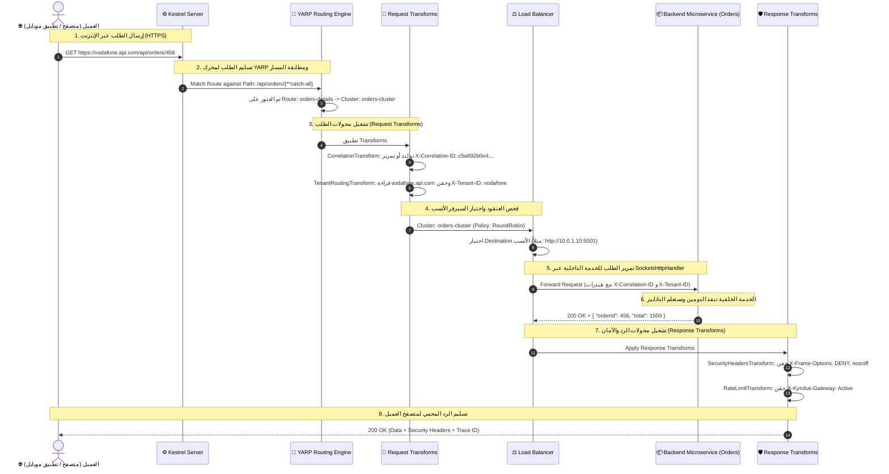

# الموسوعة الشاملة لمكتبة Gateway: المعمارية، المكونات، وطريق رحلة البيانات (Data Flow) من الألف إلى الياء

---

## 📑 فهرس المحتويات
1. [المقدمة: ما هي البوابة (API Gateway) وما هو دورها في منظومتنا؟](#1-المقدمة-ما-هي-البوابة-api-gateway-وما-هو-دورها-في-منظومتنا)
2. [التشريح المفصل لكل كلاس، إنترفيس، و Record في المكتبة](#2-التشريح-المفصل-لكل-كلاس-إنترفيس-و-record-في-المكتبة)
   - [أولاً: مشروع العقود KyrolusSous.Gateway.Abstractions](#أولاً-مشروع-العقود-kyrolussousgatewayabstractions)
   - [ثانياً: مشروع المحرك والتنفيذ KyrolusSous.Gateway.Yarp](#ثانياً-مشروع-المحرك-والتنفيذ-kyrolussousgatewayyarp)
3. [كيفية تسجيل وتشغيل البوابة في الكود (Registration & Setup)](#3-كيفية-تسجيل-وتشغيل-البوابة-في-الكود-registration--setup)
   - [الأسلوب الأول: بالكود البرمجي الكامل (Fluent Scoped Builder)](#الأسلوب-الأول-بالكود-البرمجي-الكامل-fluent-scoped-builder)
   - [الأسلوب الثاني: عبر ملف appsettings.json](#الأسلوب-الثاني-عبر-ملف-appsettingsjson)
   - [الأسلوب الثالث: الأسلوب الهجين (Hybrid: JSON + Code)](#الأسلوب-الثالث-الأسلوب-الهجين-hybrid-json--code)
4. [مخطط رحلة البيانات الشاملة (The Complete HTTP Request Data Flow)](#4-مخطط-رحلة-البيانات-الشاملة-the-complete-http-request-data-flow)
5. [رحلة الطلب خطوة بخطوة بالتفصيل الدقيق (Step-by-Step Execution Journey)](#5-رحلة-الطلب-خطوة-بخطوة-بالتفصيل-الدقيق-step-by-step-execution-journey)
   - [المرحلة 1: وصول النبضة الشبكية من المتصفح / الموبايل](#المرحلة-1-وصول-النبضة-الشبكية-من-المتصفح--الموبايل)
   - [المرحلة 2: مطابقة المسار (Route Matching)](#المرحلة-2-مطابقة-المسار-route-matching)
   - [المرحلة 3: تشغيل محولات الطلب (Request Transforms Pipeline)](#المرحلة-3-تشغيل-محولات-الطلب-request-transforms-pipeline)
   - [المرحلة 4: اختيار السيرفر وتوزيع الأحمال (Load Balancing & Destination Selection)](#المرحلة-4-اختيار-السيرفر-وتوزيع-الأحمال-load-balancing--destination-selection)
   - [المرحلة 5: الإرسال للخدمة الخلفية (Internal Forwarding via SocketsHttpHandler)](#المرحلة-5-الإرسال-للخدمة-الخلفية-internal-forwarding-via-socketshttphandler)
   - [المرحلة 6: معالجة الخدمة الخلفية وعودة الرد الأولي (Backend Response)](#المرحلة-6-معالجة-الخدمة-الخلفية-وعودة-الرد-الأولي-backend-response)
   - [المرحلة 7: تشغيل محولات الرد والأمان (Response Transforms & Security Headers)](#المرحلة-7-تشغيل-محولات-الرد-والأمان-response-transforms--security-headers)
   - [المرحلة 8: تسليم الرد الآمن والمشفر لمتصفح العميل](#المرحلة-8-تسليم-الرد-الآمن-والمشفر-لمتصفح-العميل)
6. [الأسئلة المعمارية الشائعة وحالات الطوارئ (Troubleshooting & FAQ)](#6-الأسئلة-المعمارية-الشائعة-وحالات-الطوارئ-troubleshooting--faq)

---

## 1. المقدمة: ما هي البوابة (API Gateway) وما هو دورها في منظومتنا؟

الـ **API Gateway** هي خط الدفاع الأول وأول نقطة تلامس برمجية تستقبل اتصالات الإنترنت الواردة من العالم الخارجي.

### وظائف البوابة الأساسية:
1. **البروكسي العكسي (Reverse Proxy)**: إخفاء طوبولوجيا وبنية الشبكة الداخلية (IPs، Ports، Docker Containers) عن العميل الخارجي.
2. **عزل المستأجرين (Multi-Tenancy Subdomain Routing)**: فحص النطاق واستخراج اسم الشركة المالكة للطلب تلقائياً.
3. **التتبع الموزع (Distributed Tracing)**: ضمان أن كل ريكوست يدخل النظام يحمل كود تتبع فريد (`X-Correlation-ID`) يتنقل معه عبر كافة الخدمات.
4. **الحماية والدفاع المبكر (Edge Security Headers)**: حقن هيدرات الأمان لمنع هجمات المتصفحات مثل `Clickjacking` و `MIME Sniffing` قبل وصول الرد للعميل.
5. **توزيع الأحمال (Load Balancing)**: توزيع ضغط الزيارات بين خوادم الخدمة المتعددة وفق خوارزميات ذكية لمنع سقوط أي سيرفر.

---

## 2. التشريح المفصل لكل كلاس، إنترفيس، و Record في المكتبة

تتكون البوابة في مكتبتنا من مشروعين منفصلين وفق مبدأ فصل الاهتمامات (Separation of Concerns):

---

### أولاً: مشروع العقود `KyrolusSous.Gateway.Abstractions`
*هذا المشروع يحتوي على العقود والـ Models الأساسية بدون أي تبعية لمحرك معين.*

#### 1. [`KyrolusGatewayDestination.cs`](file:///d:/2%20Mylibraries/KyrolusSous.AspNetCoreToolkit/Src/Gateway/KyrolusSous.Gateway.Abstractions/KyrolusGatewayDestination.cs)
```csharp
public sealed record KyrolusGatewayDestination(string Address);
```
- **ما هو؟**: كائن Record غير قابل للتعديل (Immutable) يمثل **عنوان خادم حقيقي واحد** داخل شبكتك الخاصة.
- **الخصائص**:
  - `Address`: الرابط الداخلي للخدمة، مثلاً: `"http://10.0.1.20:5000"` أو `"https://orders-service:5001"`.
- **الفائدة**: تحديد السيرفرات الفعلية التي تستقبل الـ Traffic وتنفذ الكود.

#### 2. [`KyrolusGatewayCluster.cs`](file:///d:/2%20Mylibraries/KyrolusSous.AspNetCoreToolkit/Src/Gateway/KyrolusSous.Gateway.Abstractions/KyrolusGatewayCluster.cs)
```csharp
public sealed record KyrolusGatewayCluster
{
    public required string ClusterId { get; init; }
    public required IReadOnlyDictionary<string, KyrolusGatewayDestination> Destinations { get; init; }
    public string? LoadBalancingPolicy { get; init; }
}
```
- **ما هو؟**: يمثل **"عنقود الخدمات المتكافئة"** (Cluster).
- **الخصائص**:
  - `ClusterId`: الاسم المعرف للعنقود (مثال: `"invoices-cluster"`).
  - `Destinations`: قاموس يحتوي على جميع السيرفرات المكررة (Replicas) لنفس الخدمة (مثلاً سيرفر 1 وسيرفر 2).
  - `LoadBalancingPolicy`: اسم خوارزمية توزيع الحمل بين هذه السيرفرات.

#### 3. [`KyrolusGatewayRouteMatch.cs`](file:///d:/2%20Mylibraries/KyrolusSous.AspNetCoreToolkit/Src/Gateway/KyrolusSous.Gateway.Abstractions/KyrolusGatewayRouteMatch.cs)
```csharp
public sealed record KyrolusGatewayRouteMatch
{
    public required string Path { get; init; }
    public IReadOnlyList<string>? Methods { get; init; }
    public IReadOnlyList<string>? Hosts { get; init; }
}
```
- **ما هو؟**: شروط مطابقة الريكوست الوارد من الإنترنت.
- **الخصائص**:
  - `Path`: نمط المسار المطلوب، مثل: `"/api/invoices/{**catch-all}"`.
  - `Methods`: نوع الطلب (مثل `GET`, `POST`, `PUT`, `DELETE`). إذا كانت فارغة يقبل كل أنواع الـ HTTP Verbs.
  - `Hosts`: قصر التوجيه على نطاقات محددة (مثل `api.mycompany.com`).

#### 4. [`KyrolusGatewayRoute.cs`](file:///d:/2%20Mylibraries/KyrolusSous.AspNetCoreToolkit/Src/Gateway/KyrolusSous.Gateway.Abstractions/KyrolusGatewayRoute.cs)
```csharp
public sealed record KyrolusGatewayRoute
{
    public required string RouteId { get; init; }
    public required string ClusterId { get; init; }
    public required KyrolusGatewayRouteMatch Match { get; init; }
    public IReadOnlyDictionary<string, string>? Metadata { get; init; }
}
```
- **ما هو؟**: قاعدة التوجيه (Routing Rule) التي تربط شروط المطابقة (`Match`) بالعنقود المستهدف (`ClusterId`).

#### 5. [`IKyrolusDynamicRouteProvider.cs`](file:///d:/2%20Mylibraries/KyrolusSous.AspNetCoreToolkit/Src/Gateway/KyrolusSous.Gateway.Abstractions/IKyrolusDynamicRouteProvider.cs)
```csharp
public interface IKyrolusDynamicRouteProvider
{
    Task<IReadOnlyList<KyrolusGatewayRoute>> GetRoutesAsync(CancellationToken cancellationToken = default);
    Task<IReadOnlyList<KyrolusGatewayCluster>> GetClustersAsync(CancellationToken cancellationToken = default);
    Task ReloadAsync(CancellationToken cancellationToken = default);
}
```
- **ما هو؟**: العقد البرمجي لإدارة المسارات والعناقيد وتحديثها أثناء تشغيل السيرفر دون توقف (Zero Downtime).

#### 6. [`KyrolusLoadBalancingPolicy.cs`](file:///d:/2%20Mylibraries/KyrolusSous.AspNetCoreToolkit/Src/Gateway/KyrolusSous.Gateway.Abstractions/KyrolusLoadBalancingPolicy.cs)
```csharp
public enum KyrolusLoadBalancingPolicy
{
    RoundRobin,
    LeastRequests,
    Random,
    PowerOfTwoChoices,
    Custom
}
```
- **ما هو؟**: الـ Enum الذي يحدد خوارزمية توزيع الأحمال بأمان تام من أخطاء الـ Typo:
  - `RoundRobin`: التوزيع الدوري العادل (طلب لسيرفر 1 ثم طلب لسيرفر 2 ثم سيرفر 3 بالتوالي).
  - `LeastRequests`: توجيه الطلب إلى السيرفر الذي يعالج أقل عدد من الريكوستات في تلك اللحظة.
  - `Random`: اختيار سيرفر عشوائياً.
  - `PowerOfTwoChoices`: اختيار سيرفرين عشوائياً وتوجيه الريكوست للأقل حملاً بينهما.

#### 7. [`KyrolusLoadBalancingPolicies.cs`](file:///d:/2%20Mylibraries/KyrolusSous.AspNetCoreToolkit/Src/Gateway/KyrolusSous.Gateway.Abstractions/KyrolusLoadBalancingPolicies.cs)
```csharp
public static class KyrolusLoadBalancingPolicies
{
    public const string RoundRobin = "RoundRobin";
    public const string LeastRequests = "LeastRequests";
    public const string Random = "Random";
    public const string PowerOfTwoChoices = "PowerOfTwoChoices";
}
```
- **ما هو؟**: ثوابت نصية قياسية لمن يفضل استخدام الـ Strings المتوافقة مباشرة مع YARP.

---

### ثانياً: مشروع المحرك والتنفيذ `KyrolusSous.Gateway.Yarp`
*هذا المشروع هو المحرك التنفيذي عالي الأداء المبني فوق Microsoft YARP.*

#### 8. [`Configuration/KyrolusClusterBuilder.cs`](file:///d:/2%20Mylibraries/KyrolusSous.AspNetCoreToolkit/Src/Gateway/KyrolusSous.Gateway.Yarp/Configuration/KyrolusClusterBuilder.cs)
- **ما هو؟**: كلاس البناء الانسيابي (Fluent Scoper) الذي يحل مشكلة تكرار `ClusterId`:
  - يستقبل `clusterId` مرة واحدة في الـ Constructor.
  - يوفر دوال: `WithLoadBalancing(KyrolusLoadBalancingPolicy)`, `AddDestination(...)`, `AddRoute(...)`.
  - عند استدعاء `Build()`، ينتج كائن العنقود ويربط جميع المسارات بداخله بنفس الـ `ClusterId` تلقائياً.

#### 9. [`Configuration/KyrolusCustomProxyConfig.cs`](file:///d:/2%20Mylibraries/KyrolusSous.AspNetCoreToolkit/Src/Gateway/KyrolusSous.Gateway.Yarp/Configuration/KyrolusCustomProxyConfig.cs)
- **ما هو؟**: تنفيذ داخلي لإنترفيس مايكروسوفت `IProxyConfig`، يحتفظ بلقطة لحظية (Snapshot) للمسارات والعناقيد في الذاكرة مع `IChangeToken` لإعلام المحرك بأي تحديث لحظي.

#### 10. [`Configuration/KyrolusDynamicInMemoryRouteConfigProvider.cs`](file:///d:/2%20Mylibraries/KyrolusSous.AspNetCoreToolkit/Src/Gateway/KyrolusSous.Gateway.Yarp/Configuration/KyrolusDynamicInMemoryRouteConfigProvider.cs)
- **ما هو؟**: المحرك المركزي الذي يربط بين مكتبتنا وبين YARP:
  - يحتفظ بالقوائم `_routes` و `_clusters`.
  - ينفذ `AddCluster(clusterId, builder)` للبناء بالكود.
  - ينفذ `LoadFromConfiguration(IConfigurationSection)` لقراءة الـ JSON.
  - ينفذ دالة `GetConfig()` التي تحول كائناتنا إلى كائنات YARP الرسمية (`RouteConfig`, `ClusterConfig`).

#### 11. [`Transforms/KyrolusCorrelationTransformProvider.cs`](file:///d:/2%20Mylibraries/KyrolusSous.AspNetCoreToolkit/Src/Gateway/KyrolusSous.Gateway.Yarp/Transforms/KyrolusCorrelationTransformProvider.cs)
- **ما هو؟**: محول طلبات (Request Transform) يفحص هيدر `X-Correlation-ID`. إذا لم يكن موجوداً يولد كود فريد `Guid.NewGuid().ToString("N")` ويحقنه في الطلب المتجه للخدمة الخلفية.

#### 12. [`Transforms/KyrolusTenantRoutingTransformProvider.cs`](file:///d:/2%20Mylibraries/KyrolusSous.AspNetCoreToolkit/Src/Gateway/KyrolusSous.Gateway.Yarp/Transforms/KyrolusTenantRoutingTransformProvider.cs)
- **ما هو؟**: محول طلبات (Request Transform) يفحص الـ Hostname. إذا وجد نطاقاً فرعياً (مثلاً `vodafone.myapi.com`) يقتطع الجزء الأول ويحقن هيدر `X-Tenant-ID: vodafone`.

#### 13. [`Transforms/KyrolusSecurityHeadersTransformProvider.cs`](file:///d:/2%20Mylibraries/KyrolusSous.AspNetCoreToolkit/Src/Gateway/KyrolusSous.Gateway.Yarp/Transforms/KyrolusSecurityHeadersTransformProvider.cs)
- **ما هو؟**: محول ردود (Response Transform) يعترض الرد المتجه للمتصفح ويحقن:
  - `X-Content-Type-Options: nosniff`
  - `X-Frame-Options: DENY`
  - `X-XSS-Protection: 1; mode=block`

#### 14. [`Transforms/KyrolusRateLimitTransformProvider.cs`](file:///d:/2%20Mylibraries/KyrolusSous.AspNetCoreToolkit/Src/Gateway/KyrolusSous.Gateway.Yarp/Transforms/KyrolusRateLimitTransformProvider.cs)
- **ما هو؟**: محول ردود (Response Transform) يضيف هيدر `X-Kyrolus-Gateway: Active` لإثبات مرور الرد عبر درع حماية البوابة.

#### 15. [`Extensions/ServiceCollectionExtensions.cs`](file:///d:/2%20Mylibraries/KyrolusSous.AspNetCoreToolkit/Src/Gateway/KyrolusSous.Gateway.Yarp/Extensions/ServiceCollectionExtensions.cs)
- **ما هو؟**: نقطة المدخل الموحدة لحقن التبعيات (DI Extension Methods) التي تسجل المحولات، ومزود التكوين، وتستدعي `AddReverseProxy()`.

---

## 3. كيفية تسجيل وتشغيل البوابة في الكود (Registration & Setup)

لتشغيل البوابة في مشروع الـ Gateway (المشروع الذي يستقبل الطلبات)، نقوم بضبط ملف `Program.cs` بإحدى الطرق الثلاث التالية:

---

### الأسلوب الأول: بالكود البرمجي الكامل (Fluent Scoped Builder)
*وهو الأسلوب الأقوى الذي يمنع تكرار `ClusterId` ويستخدم الـ Enum بأعلى درجات الأمان من الأخطاء:*

```csharp
using KyrolusSous.Gateway.Abstractions;
using KyrolusSous.Gateway.Yarp;

var builder = WebApplication.CreateBuilder(args);

// تسجيل البوابة وضبط الخدمات والمسارات بالكود:
builder.Services.AddKyrolusYarpGateway(gateway =>
{
    // عنقود خدمة الطلبات (Orders Service)
    gateway.AddCluster("orders-cluster", cluster =>
    {
        cluster.WithLoadBalancing(KyrolusLoadBalancingPolicy.RoundRobin)
               .AddDestination("srv-orders-1", "http://10.0.1.10:5001")
               .AddDestination("srv-orders-2", "http://10.0.1.11:5001")
               .AddRoute("orders-get-all", "/api/orders", "GET")
               .AddRoute("orders-create", "/api/orders", "POST")
               .AddRoute("orders-details", "/api/orders/{id}");
    });

    // عنقود خدمة الفواتير (Invoices Service)
    gateway.AddCluster("invoices-cluster", cluster =>
    {
        cluster.WithLoadBalancing(KyrolusLoadBalancingPolicy.LeastRequests)
               .AddDestination("srv-inv-1", "http://10.0.2.10:5002")
               .AddRoute("invoices-catchall", "/api/invoices/{**catch-all}");
    });
});

var app = builder.Build();

// تفعيل خط أنابيب البروكسي العكسي:
app.MapReverseProxy();

app.Run();
```

---

### الأسلوب الثاني: عبر ملف `appsettings.json`
*لو أردت وضع المسارات بالكامل داخل ملف الإعدادات الخارجي:*

**في `appsettings.json`**:
```json
{
  "ReverseProxy": {
    "Routes": {
      "orders-route": {
        "ClusterId": "orders-cluster",
        "Match": {
          "Path": "/api/orders/{**catch-all}",
          "Methods": [ "GET", "POST" ]
        }
      }
    },
    "Clusters": {
      "orders-cluster": {
        "LoadBalancingPolicy": "RoundRobin",
        "Destinations": {
          "srv1": { "Address": "http://10.0.1.10:5001" },
          "srv2": { "Address": "http://10.0.1.11:5001" }
        }
      }
    }
  }
}
```

**في `Program.cs`**:
```csharp
var builder = WebApplication.CreateBuilder(args);

// تمرير الـ Configuration مباشرة:
builder.Services.AddKyrolusYarpGateway(builder.Configuration, "ReverseProxy");

var app = builder.Build();
app.MapReverseProxy();
app.Run();
```

---

### الأسلوب الثالث: الأسلوب الهجين (Hybrid: JSON + Code)
*تحميل المسارات الأساسية من الـ JSON مع إضافة مسارات برمجية إضافية بالكود في نفس الوقت:*

```csharp
builder.Services.AddKyrolusYarpGateway(builder.Configuration, "ReverseProxy", gateway =>
{
    // إضافة خدمة إضافية غير موجودة في الـ JSON برمجياً:
    gateway.AddCluster("reporting-cluster", cluster =>
    {
        cluster.WithLoadBalancing(KyrolusLoadBalancingPolicy.Random)
               .AddDestination("rep-1", "http://10.0.3.5:5005")
               .AddRoute("reports-route", "/api/reports/{**catch-all}");
    });
});
```

---

## 4. مخطط رحلة البيانات الشاملة (The Complete HTTP Request Data Flow)



---

## 5. رحلة الطلب خطوة بخطوة بالتفصيل الدقيق (Step-by-Step Execution Journey)

تعال نعيش ما يحدث في أجزاء من الثانية (Microseconds) عندما يضغط عميل على زر في الموبايل أو المتصفح:

---

### المرحلة 1: وصول النبضة الشبكية من المتصفح / الموبايل
1. يقوم متصفح العميل بفتح اتصال TCP/TLS وإرسال طلب HTTP:
   ```http
   GET /api/orders/456 HTTP/1.1
   Host: vodafone.api.myplatform.com
   User-Agent: Mozilla/5.0...
   Accept: application/json
   ```
2. يستقبل خادم **Kestrel** الطلب على المنفذ `443` (HTTPS) ويفك تشفير الـ TLS، ثم يسلمه لخط أنابيب الـ Middleware.
3. يصل الطلب إلى `app.MapReverseProxy()` حيث ينتظر محرك YARP.

---

### المرحلة 2: مطابقة المسار (Route Matching)
1. محرك YARP يستشير كائن `KyrolusCustomProxyConfig` الموجود في الذاكرة عبر دالة `GetConfig()`.
2. يقوم المحرك بفحص جدول المسارات المجهزة (`Routes`):
   - يفحص `Path`: هل الرابط `/api/orders/456` يطابق النمط `/api/orders/{**catch-all}`؟ **نعم**.
   - يفحص `Methods`: هل `GET` مسموح في هذا المسار؟ **نعم**.
   - يفحص `Hosts`: هل الهوست مسموح؟ **نعم**.
3. النتيجة: تم التعرف على المسار بنجاح، ووجد أن هذا المسار يتبع عنقوداً اسمه:
   `ClusterId = "orders-cluster"`.

---

### المرحلة 3: تشغيل محولات الطلب (Request Transforms Pipeline)
قبل إرسال الطلب للخوادم الداخلية، يمر الريكوست على الـ Transforms المسجلة:

1. **[`KyrolusCorrelationTransformProvider`](file:///d:/2%20Mylibraries/KyrolusSous.AspNetCoreToolkit/Src/Gateway/KyrolusSous.Gateway.Yarp/Transforms/KyrolusCorrelationTransformProvider.cs)**:
   - يفحص الهيدر: هل العميل أرسل معه `X-Correlation-ID`؟
   - لو لم يرسل: ينشئ فوراً Guid فريد جديد: `a7b9c1d2e3f4...`.
   - يقوم بحقنه في `ProxyRequest.Headers["X-Correlation-ID"]`.
2. **[`KyrolusTenantRoutingTransformProvider`](file:///d:/2%20Mylibraries/KyrolusSous.AspNetCoreToolkit/Src/Gateway/KyrolusSous.Gateway.Yarp/Transforms/KyrolusTenantRoutingTransformProvider.cs)**:
   - يقرأ الـ Host: `vodafone.api.myplatform.com`.
   - يجزئ النص بواسطة النقطة `.`: فيكون الجزء الأول هو `vodafone`.
   - يقوم بحقن هيدر داخلي: `ProxyRequest.Headers["X-Tenant-ID"] = "vodafone"`.

---

### المرحلة 4: اختيار السيرفر وتوزيع الأحمال (Load Balancing)
1. محرك البوابة يذهب إلى العنقود `orders-cluster`.
2. يجد أن هذا العنقود مسجل به سيرفران:
   - السيرفر الأول: `http://10.0.1.10:5001`
   - السيرفر الثاني: `http://10.0.1.11:5001`
3. يقرأ سياسة توزيع الحمل:
   `LoadBalancingPolicy = KyrolusLoadBalancingPolicy.RoundRobin`.
4. الخوارزمية ترى أن الطلب السابق ذهب للسيرفر الأول، فتقرر فوراً توجيه هذا الطلب إلى السيرفر الثاني `http://10.0.1.11:5001`.

---

### المرحلة 5: الإرسال للخدمة الخلفية (Internal Forwarding)
1. يقوم محرك YARP عبر `SocketsHttpHandler` (عالي الكفاءة وبدون استهلاك ذاكرة Zero-Allocation Memory Streaming) بإنشاء اتصال داخلي سريع جداً مع السيرفر:
   `http://10.0.1.11:5001/api/orders/456`.
2. الطلب المرسل للسيرفر الداخلي يحتوي الآن على الهيدرات المضافة:
   ```http
   GET /api/orders/456 HTTP/1.1
   Host: 10.0.1.11:5001
   X-Correlation-ID: a7b9c1d2e3f4...
   X-Tenant-ID: vodafone
   ```

---

### المرحلة 6: معالجة الخدمة الخلفية وعودة الرد الأولي
1. خدمة الطلبات الداخلية (Orders Microservice) تستقبل الطلب.
2. تقرأ `X-Tenant-ID` وتعرف أنها تتعامل مع بيانات شركة `vodafone`.
3. تستعلم قاعدة البيانات وتجهز الرد.
4. ترسل رد HTTP للبوابة:
   ```http
   HTTP/1.1 200 OK
   Content-Type: application/json
   
   { "orderId": 456, "status": "Shipped", "total": 1500 }
   ```

---

### المرحلة 7: تشغيل محولات الرد والأمان (Response Transforms)
قبل أن يخرج الرد من البوابة في طريقه إلى الإنترنت، تعترضه محولات الرد:

1. **[`KyrolusSecurityHeadersTransformProvider`](file:///d:/2%20Mylibraries/KyrolusSous.AspNetCoreToolkit/Src/Gateway/KyrolusSous.Gateway.Yarp/Transforms/KyrolusSecurityHeadersTransformProvider.cs)**:
   - يحقن ترويسات حماية المتصفحات الصارمة:
     ```http
     X-Content-Type-Options: nosniff
     X-Frame-Options: DENY
     X-XSS-Protection: 1; mode=block
     ```
   - *هذه الهيدرات تضمن أن المتصفح سيرفض تحميل أي سكربت خبيث، ويمنع فتح الصفحة داخل IFrame خبيث.*
2. **[`KyrolusRateLimitTransformProvider`](file:///d:/2%20Mylibraries/KyrolusSous.AspNetCoreToolkit/Src/Gateway/KyrolusSous.Gateway.Yarp/Transforms/KyrolusRateLimitTransformProvider.cs)**:
   - يحقن:
     ```http
     X-Kyrolus-Gateway: Active
     ```

---

### المرحلة 8: تسليم الرد الآمن والمشفر لمتصفح العميل
يستلم متصفح العميل الرد النهائي كاملاً، مؤمناً، وموجهاً بأقصى سرعة وأعلى معايير الأمان المتبعة في كبرى المنصات السحابية العالمية!

---

## 6. الأسئلة المعمارية الشائعة وحالات الطوارئ (Troubleshooting & FAQ)

### س 1: ماذا يحدث لو سقط أحد سيرفرات الخدمة الخلفية (مثلاً سيرفر 2 انهار)؟
- يدعم YARP تقنية **Active & Passive Health Checks**؛ عندما يفشل السيرفر في الرد، يقوم YARP بوسمه تلقائياً كـ `Unhealthy` ويستبعده من قائمة الـ `Destinations`، ويحول كافة الطلبات تلقائياً للسيرفرات المتبقية دون أن يشعر المستخدم النهائي بأي عطل.

### س 2: هل تؤدي كثرة الـ Transforms إلى بطء البوابة؟
- **إطلاقاً**. جميع الـ Transforms التي صممناها في المكتبة تعمل بنمط `ValueTask` المتوافق مع الـ Async وتعتمد على التعديل المباشر في مؤشرات الترويسات (Header Dictionaries) في الذاكرة دون أي عمليات Reflection أو Serialization تستهلك المعالج.

### س 3: هل أحتاج لعمل كود خاص بالـ CORS في كل ميكروسيرفيس؟
- **لا**. بما أن جميع طلبات العالم الخارجي تذهب للبوابة فقط (نفس الدومين `api.mycompany.com`)، فإنك تضبط الـ CORS مرة واحدة فقط في البوابة، وتتصل البوابة بالسيرفرات الداخلية عبر شبكة السيرفرات الخاصة (Private Network) دون أي قيود متصفح.
