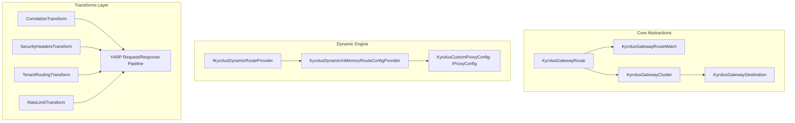

# الدليل الشامل والمفصل لمعمارية YARP Gateway: بين ملف JSON والبرمجة بالكود (Code vs appsettings.json)

---

## 🧭 السؤال الجوهري الذي يسأله كل مطور:
> **"أنا معتاد في شروحات YARP على الإنترنت أننا نضع الإعدادات داخل ملف `appsettings.json` تحت قسم `"ReverseProxy"`، فلماذا أنشأنا كل هذه الملفات والكلاسات (`KyrolusGatewayRoute`, `KyrolusGatewayCluster`, `KyrolusDynamicInMemoryRouteConfigProvider`)؟ هل استخدام JSON صح أم خطأ؟ وما الفرق بينهما؟"**

هذا السؤال هو جوهر الفرق بين **"التطبيقات البسيطة / التعليمية (Demo Apps)"** وبين **"معمارية المؤسسات الكبرى متعددة المستأجرين (Enterprise Multi-Tenant Architectures)"**.

كلا الأسلوبين **صحيح 100%**، ولكن لكل منهما استخدام وحالة واقعية. هذا الدليل يوضح لك كل شيء بالتفصيل الممل وبالأمثلة العملية.

---

## 1️⃣ الطريقة الأولى: الإعداد التقليدي عبر `appsettings.json` (Static Configuration)

### كيف تبدو هذه الطريقة؟
في الشروحات البسيطة، تقوم مايكروسوفت بوضع إعدادات التوجيه مباشرة داخل ملف الـ JSON كالتالي:

```json
{
  "Logging": {
    "LogLevel": {
      "Default": "Information"
    }
  },
  "ReverseProxy": {
    "Routes": {
      "orders-route": {
        "ClusterId": "orders-cluster",
        "Match": {
          "Path": "/api/orders/{**catch-all}"
        }
      }
    },
    "Clusters": {
      "orders-cluster": {
        "Destinations": {
          "destination1": {
            "Address": "https://orders-service.local:5001"
          }
        }
      }
    }
  }
}
```

ثم في كود الـ `Program.cs` يتم كتابة سطرين فقط:
```csharp
var builder = WebApplication.CreateBuilder(args);

// قراءة الإعدادات من ملف الـ JSON
builder.Services.AddReverseProxy()
    .LoadFromConfig(builder.Configuration.GetSection("ReverseProxy"));

var app = builder.Build();
app.MapReverseProxy();
app.Run();
```

---

### ما الذي تفعله مايكروسوفت سراً خلف الكواليس في دالة `.LoadFromConfig(...)`؟
عندما تستدعي `.LoadFromConfig(...)`، مايكروسوفت لا تفعل شيئاً سحرياً!
هي تقوم بتسجيل كلاس داخلي اسمه:
`ConfigurationConfigProvider`
وهذا الكلاس ينفذ نفس الإنترفيس الذي بنينا عليه مكتبتنا:
`IProxyConfigProvider`!

أي أن مايكروسوفت نفسها تقرأ الـ JSON وتحوله إلى كائنات C# برمجية في الذاكرة مطابقة تماماً لما نفعله!

---

### متى تكون طريقة `appsettings.json` ممتازة ومناسبة؟
1. **المشاريع الصغيرة والثابتة**: لديك 2 أو 3 ميكروسيرفيس ولا تتغير مساراتها أو عناوينها إطلاقاً.
2. **البيئات البسيطة**: لا تحتاج لتغيير مسارات أثناء عمل السيرفر (Zero Downtime).
3. **عدم وجود منطق برمجي معقد**: التوجيه مبني فقط على الرابط الأساسي بدون استخراج Subdomains ديناميكية أو فحص قواعد بيانات.

---

### عيوب وقصور `appsettings.json` في بيئات الإنتاج الكبرى (Enterprise Pitfalls):

1. **الجمود وعدم الديناميكية (Static vs. Dynamic)**:
   - لو أردت إضافة مسار جديد أو خدمة جديدة في منتصف الليل أثناء تشغيل السيرفر، هل ستفتح ملف `appsettings.json` على سيرفر الإنتاج وتعدله يدوياً؟
   - لو انهار أحد السيرفرات وأردت توجيه الترافيك لسيرفر طوارئ، الـ JSON لن يساعدك برمجياً.

2. **الغياب التام لفحص الأخطاء أثناء التجميع (No Type Safety & No IntelliSense)**:
   - الـ JSON مجرد نصوص (`strings`). لو كتبت بالخطأ `"ClustrId"` بدلاً من `"ClusterId"`، فلن يعترض الكومبايلر، وسيعمل السيرفر ثم ينهار فجأة في الـ Production عند أول ريكوست!

3. **استحالة الربط مع قواعد البيانات أو لوحات التحكم (Admin Portals)**:
   - في الشركات الحقيقية، يكون هناك لوحة تحكم (Dashboard) لمهندسي الـ DevOps يضيفون منها Microservices جديدة بضغطة زر. كيف للوحة التحكم أن تحدث ملف JSON موجود على 10 سيرفرات مختلفة؟ البيانات يجب أن تأتي من SQL Database أو Redis!

4. **العجز عن كتابة منطق برمجي (Business Logic & Custom Transforms)**:
   - ملف الـ JSON لا يستطيع أن يفحص الهوست، ولا يستطيع أن يقطع الرابط لمعرفة اسم الشركة (`tenant-a.domain.com` -> `X-Tenant-ID: tenant-a`)، ولا يستطيع توليد GUID أو التحقق من قوائم التوكنات السوداء في الـ Cache! هذه العمليات **تحتاج كود C# صريح**.

---

## 2️⃣ الطريقة الثانية: البرمجة المباشرة والتحكم الكامل بالكود (Programmatic & Dynamic Approach)

هذا هو السبب الدقيق الذي جعلنا نبني مشروعي:
- `KyrolusSous.Gateway.Abstractions`
- `KyrolusSous.Gateway.Yarp`

---

### لماذا صممنا الكلاسات المنفصلة؟



### 1. إعطاء المطور Type Safety و IntelliSense كامل:
بدلاً من كتابة نصوص JSON عشوائية معرضة للأخطاء الإملائية، يكتب المطور كود C# آمن 100% وخاضع لرقابة الـ Compiler:
```csharp
var route = new KyrolusGatewayRoute
{
    RouteId = "orders-route",
    ClusterId = "orders-cluster",
    Match = new KyrolusGatewayRouteMatch
    {
        Path = "/api/orders/{**catch-all}",
        Methods = new[] { "GET", "POST" }
    }
};
```
لو نسيت خاصية أو كتبت حرفاً خطأ، لن يكتمل الـ Build ولن تحدث كارثة في الإنتاج.

---

### 2. التوجيه الديناميكي المباشر من الذاكرة أو الداتابيز:
بفضل كلاس:
[`KyrolusDynamicInMemoryRouteConfigProvider.cs`](file:///d:/2%20Mylibraries/KyrolusSous.AspNetCoreToolkit/Src/Gateway/KyrolusSous.Gateway.Yarp/Configuration/KyrolusDynamicInMemoryRouteConfigProvider.cs)
أصبح بإمكانك في أي لحظة أثناء عمل التطبيق إضافة أو إزالة مسارات لحظياً:
```csharp
// إضافة مسار جديد في Runtime بدون عمل Restart للسيرفر نهائياً
routeConfigProvider.AddRoute(newRoute);
routeConfigProvider.AddCluster(newCluster);
```

---

### 3. ما هي الـ Transforms التي لا يمكن لملف الـ JSON فعلها؟

هنا تكمن قوة معماريتنا! في مجلد `Transforms/` قمنا بإنشاء 4 محولات ذكية تعمل أثناء تدفق الطلب:

#### أ. محول كود التتبع (`KyrolusCorrelationTransformProvider`):
- يقرأ `X-Correlation-ID` من الطلب الوارد.
- إن لم يكن موجوداً، ينشئ Guid جديد ويحقنه في الطلب قبل أن يصل للميكروسيرفيس.
- **النتيجة**: كل حركة في السيستم من البوابة حتى أعمق ميكروسيرفيس تصبح مربوطة بنفس كود التتبع في اللوجز.

#### ب. محول هيدرات الأمان الصارمة (`KyrolusSecurityHeadersTransformProvider`):
- يحقن هيدرات الحماية من هجمات الاختراق في الرد العائد للمتصفح:
  - `X-Frame-Options: DENY` (يمنع تضمين موقعك في iframe لاصطياد نقرات المستخدمين Clickjacking).
  - `X-Content-Type-Options: nosniff` (يمنع خداع المتصفح لتحميل ملف خبيث بصيغة وهمية).
  - `X-XSS-Protection: 1; mode=block`.

#### ج. محول عزل المستأجرين (`KyrolusTenantRoutingTransformProvider`):
- عندما يزور عميل رابط مثل: `vodafone.myplatform.com/api/orders`.
- هذا الكود يقوم ببرمجة واقتطاع الجزء الأول `vodafone`.
- ثم يحقن هيدر داخلي: `X-Tenant-ID: vodafone` ويرسله للميكروسيرفيس.
- الميكروسيرفيس لا تعبأ بالدومينات أو الـ DNS؛ هي تستلم الهيدر فوراً وتفلتر داتابيز شركة فودافون!
- **هذا مستحيل برمجته داخل ملف JSON ثابت!**

#### د. محول الحالة والـ Rate Limiting (`KyrolusRateLimitTransformProvider`):
- يحقن ترويسات حالة ونشاط البوابة ليعرف العميل والمراقبون أن الطلب تم مروره عبر بوابة الأمان الموحدة.

---

## 3️⃣ جدول المقارنة الشاملة: (JSON vs. Kyrolus Gateway C#)

| وجه المقارنة | `appsettings.json` التقليدي | `KyrolusSous.Gateway` (معماريتنا البرمجية) |
| :--- | :--- | :--- |
| **سهولة البداية** | سهل جداً للتجارب السريعة | احترافي ومنظم في ملفات مستقلة |
| **فحص الأخطاء (Type Safety)** | ❌ معدوم (نصوص عرضة للخطأ) | ✅ 100% آمن من الكومبايلر وله IntelliSense |
| **التعديل أثناء التشغيل (Runtime)** | ❌ يتطلب تعديل ملفات نصية يدوياً | ✅ متاح برمجياً عبر دوال `AddRoute` و `Reload` |
| **الربط مع قواعد البيانات / Redis** | ❌ مستحيل مباشرة | ✅ مدعوم عبر `IKyrolusDynamicRouteProvider` |
| **منطق المستأجرين (Multi-Tenancy)**| ❌ لا يستطيع قراءة الـ Subdomains | ✅ محول مخصص يحقن `X-Tenant-ID` تلقائياً |
| **حقن هيدرات التتبع والأمان** | ⚠️ محدود بقيم ثابتة جداً | ✅ معالجة ديناميكية بكود C# فائق السرعة |
| **معايير هندسة المؤسسات** | يصلح للـ Monolith والـ Demos | مصمم لـ Microservices و Cloud Clusters |

---

## 4️⃣ هل يمكن الدمج بين الاثنين؟ (Hybrid Approach)

**نعم بالتأكيد!**
في الأنظمة الكبيرة:
1. يمكن قراءة المسارات الثابتة الأساسية من `appsettings.json`.
2. استخدام كود C# وحزم الـ Transforms الخاصة بنا لحقن الأمان وتحديد هوية المستأجر والتتبع.
3. أو الاعتماد بالكامل على كود C# لتجنب مشاكل الـ JSON الشائعة.

---

## 💡 الخلاصة الحاسمة:
- ملف `appsettings.json` **ليس خطأ**، ولكنه مخصص للحالات الثابتة والبسيطة.
- كل الكلاسات والإنترفيسات التي قمنا بتصميمها في `KyrolusSous.Gateway.Abstractions` و `KyrolusSous.Gateway.Yarp` ليست كوداً زائداً، بل هي **البنية الأساسية المتقدمة (Enterprise Dynamic Infrastructure)** التي تحول محرك YARP من مجرد وسيط بسيط يقرأ ملف نصي، إلى **بوابة دخول ذكية ومحمية ومتحكمة في تدفق البيانات لحظياً**.
