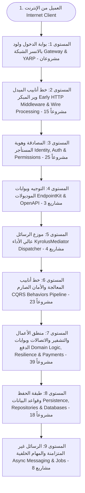

# الدليل الموسوعي الشامل لترتيب مراجعة كافة مكتبات التولكيت (137 مشروعاً من البداية للنهاية)
# Complete Top-Down HTTP Request Lifecycle: Exhaustive 137-Library Review Blueprint

---
## 🎯 فلسفة الترتيب من الأعلى للأسفل (Top-to-Down Request Lifecycle)
هذا المرجع يمثل **المسار الهندسي الدقيق للطلب (The Real Journey of an HTTP Request)** داخل بنيتنا البرمجية، متتبعاً حركة البيانات نبضة بنبضة:
1. وصول الاتصال الشبكي عبر بوابة الدخول والـ Reverse Proxy.
2. استقبال الطلب في محرك Kestrel وتطبيق ترويسات الأمان (Security Headers)، وربط كود التتبع (Correlation ID)، وتجهيز اللوجز، وفك ضغط البيانات، وصمام أمان الأخطاء الشامل.
3. عزل هوية المستأجر (Tenant Context)، والمصادقة الصارمة (JWT, API Keys, OAuth2, MFA)، وفحص الإلغاء اللحظي وتدقيق الصلاحيات.
4. توجيه المسار إلى الموديول المناسب عبر EndpointKit وتوثيق الـ APIs في Swagger.
5. تحويل الطلب فوراً إلى موزع الرسائل الداخلي (KyrolusMediator) بدون أي Reflection لدعم Native AOT.
6. سريان الأمر أو الاستعلام عبر خط الأنابيب الصارم (12-Layer Pipeline Behaviors) لفحص التدقيق، التحقق من المدخلات، الكاش، وتحويل النماذج.
7. تشغيل كود المعالج (Domain Handler): فحص أعلام الميزات (Feature Flags)، الترجمة الحية، التشفير التلقائي (Data Protection)، إجراء اتصالات خارجية مرنة ومقاومة للانهيار المتسلسل، وبوابات الدفع الإلكتروني.
8. حفظ البيانات في قواعد البيانات العلائقية (EF Core) أو الوثائقية (Marten JSONB) ومحرك البحث (Elasticsearch) مع معالجة ذكية للاستثناءات.
9. إطلاق رسائل التكامل عبر طوابير RabbitMQ وجدولة المهام الخلفية وإرسال التنبيهات والبريد الإلكتروني للعملاء.

---

---
## 🧭 الترتيب التسلسلي الفردي الكامل لكافة الـ 137 مكتبة (كل مشروع برقم خاص مستقل)

---

### المستوى 1: بوابة الدخول والبروكسي العكسي (Ingress & API Gateway Layer)
> نقطة التماس الأولى على حدود شبكة السيرفرات؛ تستقبل اتصالات TCP/TLS القادمة من الإنترنت، وتتولى توجيه الـ Domains والموازنة بين السيرفرات (Load Balancing).

1. **`KyrolusSous.Gateway.Abstractions`**
   - **المسار في الكود**: [`Src/Gateway/KyrolusSous.Gateway.Abstractions/KyrolusSous.Gateway.Abstractions.csproj`](file:///d:/2%20Mylibraries/KyrolusSous.AspNetCoreToolkit/Src/Gateway/KyrolusSous.Gateway.Abstractions/KyrolusSous.Gateway.Abstractions.csproj)
   - **الدور في دورة الطلب**: العقود الأساسية للبوابة والبروكسي وتوزيع الأحمال
   - **التفاصيل الفنية والمكونات**: يحدد عقود توجيه المسارات (IKyrolusGatewayRoute)، ومجموعات السيرفرات الخلفية (KyrolusGatewayCluster)، وسياسات الـ Load Balancing، وقواعد الـ Rate Limiting والـ Health Checks المسبقة.
2. **`KyrolusSous.Gateway.Yarp`**
   - **المسار في الكود**: [`Src/Gateway/KyrolusSous.Gateway.Yarp/KyrolusSous.Gateway.Yarp.csproj`](file:///d:/2%20Mylibraries/KyrolusSous.AspNetCoreToolkit/Src/Gateway/KyrolusSous.Gateway.Yarp/KyrolusSous.Gateway.Yarp.csproj)
   - **الدور في دورة الطلب**: محرك البروكسي العكسي فائق السرعة المبني على YARP
   - **التفاصيل الفنية والمكونات**: تنفيذ بوابة الدخول باستخدام Microsoft Reverse Proxy (YARP) عالي الأداء مع حقن هيدرات التتبع (X-Correlation-ID)، وعزل المسارات بحسب هوية المستأجر (Subdomain Routing)، وإسقاط الهجمات الأولية قبل وصولها للـ Microservices.

---

### المستوى 2: خط أنابيب الميدل وير المبكر (Early Inbound HTTP Pipeline & Wire Processing)
> الطبقة التي تستقبل الريكوست فور دخوله محرك Kestrel؛ تحقن ترويسات الأمان الصارمة، وتربط كود التتبع، وتجهز تسجيل الأحداث، وتفك ضغط محتوى الطلب، وتحيط بالعملية بصمام أمان شامل للأخطاء.

3. **`KyrolusSous.EndpointKit.Core`**
   - **المسار في الكود**: [`Src/EndpointKit/KyrolusSous.EndpointKit.Core/KyrolusSous.EndpointKit.Core.csproj`](file:///d:/2%20Mylibraries/KyrolusSous.AspNetCoreToolkit/Src/EndpointKit/KyrolusSous.EndpointKit.Core/KyrolusSous.EndpointKit.Core.csproj)
   - **الدور في دورة الطلب**: محرك ترويسات الأمان وهيدرات التتبع (Security Headers & Correlation ID)
   - **التفاصيل الفنية والمكونات**: يقدم KyrolusSecurityHeadersMiddleware لحماية المتصفحات من هجمات XSS و Clickjacking و Sniffing عبر هيدرات (X-Frame-Options, X-Content-Type-Options, Referrer-Policy, CSP)، بالإضافة إلى KyrolusCorrelationMiddleware لتوحيد Activity Trace Id عبر النظام بالكامل.
4. **`KyrolusSous.Logging.Abstractions`**
   - **المسار في الكود**: [`Src/Logging/KyrolusSous.Logging.Abstractions/KyrolusSous.Logging.Abstractions.csproj`](file:///d:/2%20Mylibraries/KyrolusSous.AspNetCoreToolkit/Src/Logging/KyrolusSous.Logging.Abstractions/KyrolusSous.Logging.Abstractions.csproj)
   - **الدور في دورة الطلب**: عقود التسجيل الزمني الموحد وسياق العمليات
   - **التفاصيل الفنية والمكونات**: واجهات IKyrolusLogger وسياق التتبع ومفاتيح مستويات التسجيل الديناميكية (LogLevel Switches).
5. **`KyrolusSous.Logging.Core`**
   - **المسار في الكود**: [`Src/Logging/KyrolusSous.Logging.Core/KyrolusSous.Logging.Core.csproj`](file:///d:/2%20Mylibraries/KyrolusSous.AspNetCoreToolkit/Src/Logging/KyrolusSous.Logging.Core/KyrolusSous.Logging.Core.csproj)
   - **الدور في دورة الطلب**: محرك الـ HTTP Logging وحجب البيانات الحساسة (Data Masking)
   - **التفاصيل الفنية والمكونات**: يتضمن KyrolusHttpLoggingMiddleware لتسجيل زمن معالجة الطلب وحجم الرد، مع محركات DataMasker و StringRedactor لحجب أرقام البطاقات وكلمات المرور والتوكنات تلقائياً من اللوجز لمنع تسريبها.
6. **`KyrolusSous.Logging.Serilog`**
   - **المسار في الكود**: [`Src/Logging/KyrolusSous.Logging.Serilog/KyrolusSous.Logging.Serilog.csproj`](file:///d:/2%20Mylibraries/KyrolusSous.AspNetCoreToolkit/Src/Logging/KyrolusSous.Logging.Serilog/KyrolusSous.Logging.Serilog.csproj)
   - **الدور في دورة الطلب**: تكامل محرك Serilog المتقدم وتنسيق Elastic Common Schema (ECS)
   - **التفاصيل الفنية والمكونات**: تحويل لوجز التطبيق إلى تنسيق JSON مهيكل متوافق مع معايير الـ Observability العالمية مع دعم الـ ANSI Console والأرشفة الدورية.
7. **`KyrolusSous.Compression.Abstractions`**
   - **المسار في الكود**: [`Src/Compression/KyrolusSous.Compression.Abstractions/KyrolusSous.Compression.Abstractions.csproj`](file:///d:/2%20Mylibraries/KyrolusSous.AspNetCoreToolkit/Src/Compression/KyrolusSous.Compression.Abstractions/KyrolusSous.Compression.Abstractions.csproj)
   - **الدور في دورة الطلب**: عقود ومواصفات خوارزميات الضغط وفك الضغط للشبكة
   - **التفاصيل الفنية والمكونات**: تعريف واجهات IKyrolusCompressor و IKyrolusCompressionProvider لإدارة عمليات فك وضغط البيانات المتدفقة.
8. **`KyrolusSous.Compression.Core`**
   - **المسار في الكود**: [`Src/Compression/KyrolusSous.Compression.Core/KyrolusSous.Compression.Core.csproj`](file:///d:/2%20Mylibraries/KyrolusSous.AspNetCoreToolkit/Src/Compression/KyrolusSous.Compression.Core/KyrolusSous.Compression.Core.csproj)
   - **الدور في دورة الطلب**: ميدل وير التفاوض على الضغط (Accept-Encoding Negotiation Middleware)
   - **التفاصيل الفنية والمكونات**: قراءة ترويسات الـ Content-Encoding وفك ضغط الـ Request Body، وتحديد أنسب خوارزمية ضغط للـ Response Body بناءً على Accept-Encoding لتوفير الباندويث وتسريع الردود.
9. **`KyrolusSous.Compression.Brotli`**
   - **المسار في الكود**: [`Src/Compression/KyrolusSous.Compression.Brotli/KyrolusSous.Compression.Brotli.csproj`](file:///d:/2%20Mylibraries/KyrolusSous.AspNetCoreToolkit/Src/Compression/KyrolusSous.Compression.Brotli/KyrolusSous.Compression.Brotli.csproj)
   - **الدور في دورة الطلب**: خوارزمية Brotli فائقة الضغط للمتصفحات الحديثة
   - **التفاصيل الفنية والمكونات**: مزود ضغط Brotli المخصص لتقليل حجم ردود الـ JSON والـ HTML بأقصى كفاءة للمتصفحات الداعمة لـ br.
10. **`KyrolusSous.Compression.Gzip`**
   - **المسار في الكود**: [`Src/Compression/KyrolusSous.Compression.Gzip/KyrolusSous.Compression.Gzip.csproj`](file:///d:/2%20Mylibraries/KyrolusSous.AspNetCoreToolkit/Src/Compression/KyrolusSous.Compression.Gzip/KyrolusSous.Compression.Gzip.csproj)
   - **الدور في دورة الطلب**: خوارزمية GZip القياسية المتوافقة عالمياً
   - **التفاصيل الفنية والمكونات**: مزود ضغط Gzip القياسي لضمان التوافقية بنسبة 100% مع كافة برمجيات الـ HTTP Clients والموبايل.
11. **`KyrolusSous.Compression.Deflate`**
   - **المسار في الكود**: [`Src/Compression/KyrolusSous.Compression.Deflate/KyrolusSous.Compression.Deflate.csproj`](file:///d:/2%20Mylibraries/KyrolusSous.AspNetCoreToolkit/Src/Compression/KyrolusSous.Compression.Deflate/KyrolusSous.Compression.Deflate.csproj)
   - **الدور في دورة الطلب**: خوارزمية Deflate السريعة وخفيفة المعالجة
   - **التفاصيل الفنية والمكونات**: محرك ضغط خفيف وسريع للأنظمة القديمة أو البروتوكولات الداخلية ذات استهلاك المعالج المنخفض.
12. **`KyrolusSous.Compression.Zstd`**
   - **المسار في الكود**: [`Src/Compression/KyrolusSous.Compression.Zstd/KyrolusSous.Compression.Zstd.csproj`](file:///d:/2%20Mylibraries/KyrolusSous.AspNetCoreToolkit/Src/Compression/KyrolusSous.Compression.Zstd/KyrolusSous.Compression.Zstd.csproj)
   - **الدور في دورة الطلب**: خوارزمية Zstandard (Meta) فائقة السرعة والأداء
   - **التفاصيل الفنية والمكونات**: توفير خوارزمية Zstandard التي تمنح نسب ضغط قريبة من Brotli بسرعات تضاهي سرعة المعالج في فك الضغط (Real-Time decompression).
13. **`KyrolusSous.Compression.Lz4`**
   - **المسار في الكود**: [`Src/Compression/KyrolusSous.Compression.Lz4/KyrolusSous.Compression.Lz4.csproj`](file:///d:/2%20Mylibraries/KyrolusSous.AspNetCoreToolkit/Src/Compression/KyrolusSous.Compression.Lz4/KyrolusSous.Compression.Lz4.csproj)
   - **الدور في دورة الطلب**: خوارزمية LZ4 اللحظية للبيانات الضخمة
   - **التفاصيل الفنية والمكونات**: خوارزمية ضغط فائقة السرعة مخصصة للاتصالات عالية التردد والـ High-throughput Microservices.
14. **`KyrolusSous.Compression.Snappy`**
   - **المسار في الكود**: [`Src/Compression/KyrolusSous.Compression.Snappy/KyrolusSous.Compression.Snappy.csproj`](file:///d:/2%20Mylibraries/KyrolusSous.AspNetCoreToolkit/Src/Compression/KyrolusSous.Compression.Snappy/KyrolusSous.Compression.Snappy.csproj)
   - **الدور في دورة الطلب**: خوارزمية Snappy (Google) للسرعة الفائقة واستقرار المعالج
   - **التفاصيل الفنية والمكونات**: خوارزمية جوجل الموجهة خصيصاً لأقل استهلاك لمعالج السيرفر (Low CPU Overhead).
15. **`KyrolusSous.ExceptionHandling.Abstractions`**
   - **المسار في الكود**: [`Src/ExceptionHandling/KyrolusSous.ExceptionHandling.Abstractions/KyrolusSous.ExceptionHandling.Abstractions.csproj`](file:///d:/2%20Mylibraries/KyrolusSous.AspNetCoreToolkit/Src/ExceptionHandling/KyrolusSous.ExceptionHandling.Abstractions/KyrolusSous.ExceptionHandling.Abstractions.csproj)
   - **الدور في دورة الطلب**: عقود تصنيف الاستثناءات ومستودع الأخطاء المعياري
   - **التفاصيل الفنية والمكونات**: عقود IExceptionToProblemDetailsMapper و IErrorRegistry وتصنيف استثناءات الدومين والسيستم.
16. **`KyrolusSous.ExceptionHandling.Runtime`**
   - **المسار في الكود**: [`Src/ExceptionHandling/KyrolusSous.ExceptionHandling.Runtime/KyrolusSous.ExceptionHandling.Runtime.csproj`](file:///d:/2%20Mylibraries/KyrolusSous.AspNetCoreToolkit/Src/ExceptionHandling/KyrolusSous.ExceptionHandling.Runtime/KyrolusSous.ExceptionHandling.Runtime.csproj)
   - **الدور في دورة الطلب**: ميدل وير صمام الأمان الشامل (Global Exception Trapping Middleware)
   - **التفاصيل الفنية والمكونات**: صمام الأمان الأساسي الذي يحيط بجميع خط أنابيب الـ ASP.NET Core، يمسك أي استثناء غير متوقع ويمنع انهيار السيرفر ويحوله لاستجابة منظمة.
17. **`KyrolusSous.ExceptionHandling.ProblemDetails`**
   - **المسار في الكود**: [`Src/ExceptionHandling/KyrolusSous.ExceptionHandling.ProblemDetails/KyrolusSous.ExceptionHandling.ProblemDetails.csproj`](file:///d:/2%20Mylibraries/KyrolusSous.AspNetCoreToolkit/Src/ExceptionHandling/KyrolusSous.ExceptionHandling.ProblemDetails/KyrolusSous.ExceptionHandling.ProblemDetails.csproj)
   - **الدور في دورة الطلب**: تنسيق تقارير الأخطاء المعيارية وفق مواصفة RFC 7807 (ProblemDetails)
   - **التفاصيل الفنية والمكونات**: محول ومولد أخطاء ProblemDetails متوافق مع معايير IETF و Native AOT، يحجب تفاصيل الـ StackTrace الحساسة في الإنتاج ويعرض رسائل واضحة وموحدة للعملاء.

---

### المستوى 3: هوية المستأجر، المصادقة والصلاحيات (Identity, Multi-Tenancy, Auth & Permissions)
> التحقق الصارم من هوية المتصل وتحديد شركته (Tenant Context)، وفحص التوكنات، ومنع الهجمات، والتحقق من الصلاحيات قبل السماح بالوصول لأي نقطة نهاية.

18. **`KyrolusSous.Auth.MultiTenancy`**
   - **المسار في الكود**: [`Src/Auth/KyrolusSous.Auth.MultiTenancy/KyrolusSous.Auth.MultiTenancy.csproj`](file:///d:/2%20Mylibraries/KyrolusSous.AspNetCoreToolkit/Src/Auth/KyrolusSous.Auth.MultiTenancy/KyrolusSous.Auth.MultiTenancy.csproj)
   - **الدور في دورة الطلب**: ميدل وير استخراج وعزل هوية المستأجر (Tenant Context Resolution)
   - **التفاصيل الفنية والمكونات**: قراءة Tenant ID من مسار الريكوست أو الهيدر (X-Tenant-ID) أو الدومين الفرعي أو الـ JWT، وتثبيته في الـ TenantContext لعزل البيانات بين العملاء تماماً.
19. **`KyrolusSous.Auth.Abstractions`**
   - **المسار في الكود**: [`Src/Auth/KyrolusSous.Auth.Abstractions/KyrolusSous.Auth.Abstractions.csproj`](file:///d:/2%20Mylibraries/KyrolusSous.AspNetCoreToolkit/Src/Auth/KyrolusSous.Auth.Abstractions/KyrolusSous.Auth.Abstractions.csproj)
   - **الدور في دورة الطلب**: عقود المصادقة، المستخدمين، الصلاحيات وجلسات الدخول
   - **التفاصيل الفنية والمكونات**: واجهات IKyrolusAuthService و IKyrolusUser و IKyrolusPermissionProvider والمطالبات (Claims).
20. **`KyrolusSous.Auth.Runtime`**
   - **المسار في الكود**: [`Src/Auth/KyrolusSous.Auth.Runtime/KyrolusSous.Auth.Runtime.csproj`](file:///d:/2%20Mylibraries/KyrolusSous.AspNetCoreToolkit/Src/Auth/KyrolusSous.Auth.Runtime/KyrolusSous.Auth.Runtime.csproj)
   - **الدور في دورة الطلب**: محرك التشفير وإنشاء الهويات (Password Hasher & Identity Core)
   - **التفاصيل الفنية والمكونات**: توليد هويات المستخدمين (ClaimsPrincipal)، ومحرك التجزئة الآمن لكلمات المرور باستخدام PBKDF2/Argon2 مع الحماية من الهجمات الحسابية.
21. **`KyrolusSous.Auth.Security`**
   - **المسار في الكود**: [`Src/Auth/KyrolusSous.Auth.Security/KyrolusSous.Auth.Security.csproj`](file:///d:/2%20Mylibraries/KyrolusSous.AspNetCoreToolkit/Src/Auth/KyrolusSous.Auth.Security/KyrolusSous.Auth.Security.csproj)
   - **الدور في دورة الطلب**: درع الحماية من التخمين الشرس وسياسات كلمات المرور (Brute Force Guard)
   - **التفاصيل الفنية والمكونات**: مراقبة محاولات الدخول الفاشلة وفرض الحظر المؤقت الذكي (Lockout)، والتحقق من سياسات قوة كلمات المرور ومطابقتها لمعايير NIST.
22. **`KyrolusSous.Auth.Jwt`**
   - **المسار في الكود**: [`Src/Auth/KyrolusSous.Auth.Jwt/KyrolusSous.Auth.Jwt.csproj`](file:///d:/2%20Mylibraries/KyrolusSous.AspNetCoreToolkit/Src/Auth/KyrolusSous.Auth.Jwt/KyrolusSous.Auth.Jwt.csproj)
   - **الدور في دورة الطلب**: محرك فحص والتحقق الصارم من توكنات الـ JWT
   - **التفاصيل الفنية والمكونات**: فحص توقيع التوكن، حظر خوارزمية none المشبوهة تماماً، فرض مفاتيح أمان لا تقل عن 256 بت، والتحقق من التواريخ والصلاحيات الزمنية (iat, exp).
23. **`KyrolusSous.Auth.ApiKey`**
   - **المسار في الكود**: [`Src/Auth/KyrolusSous.Auth.ApiKey/KyrolusSous.Auth.ApiKey.csproj`](file:///d:/2%20Mylibraries/KyrolusSous.AspNetCoreToolkit/Src/Auth/KyrolusSous.Auth.ApiKey/KyrolusSous.Auth.ApiKey.csproj)
   - **الدور في دورة الطلب**: مصادقة اتصالات الخوادم والميكروسيرفيس (API Key Authentication)
   - **التفاصيل الفنية والمكونات**: فحص وتوثيق مفاتيح الـ API Keys في هيدرات الطلب للاتصالات البرمجية وخدمات B2B مع دعم التجزئة الآمنة للمفاتيح.
24. **`KyrolusSous.Auth.TokenRevocation`**
   - **المسار في الكود**: [`Src/Auth/KyrolusSous.Auth.TokenRevocation/KyrolusSous.Auth.TokenRevocation.csproj`](file:///d:/2%20Mylibraries/KyrolusSous.AspNetCoreToolkit/Src/Auth/KyrolusSous.Auth.TokenRevocation/KyrolusSous.Auth.TokenRevocation.csproj)
   - **الدور في دورة الطلب**: فحص القائمة السوداء الفورية للتوكنات الملغاة (Token Blacklist Validator)
   - **التفاصيل الفنية والمكونات**: فحص الـ JTI الخاص بالتوكن ضد قائمة الإلغاء اللحظية عند تسجيل الخروج أو تغيير الصلاحيات لمنع إعادة استخدام التوكنات المسروقة.
25. **`KyrolusSous.Auth.Tokens`**
   - **المسار في الكود**: [`Src/Auth/KyrolusSous.Auth.Tokens/KyrolusSous.Auth.Tokens.csproj`](file:///d:/2%20Mylibraries/KyrolusSous.AspNetCoreToolkit/Src/Auth/KyrolusSous.Auth.Tokens/KyrolusSous.Auth.Tokens.csproj)
   - **الدور في دورة الطلب**: إدارة دورة حياة الـ Refresh Tokens وتدويرها الآمن
   - **التفاصيل الفنية والمكونات**: إصدار وتدوير الـ Refresh Tokens ومنع هجمات إعادة الاستخدام (Token Reuse Detection) وإبطال شجرة التوكنات بالكامل عند اكتشاف اختراق.
26. **`KyrolusSous.Auth.Permissions`**
   - **المسار في الكود**: [`Src/Auth/KyrolusSous.Auth.Permissions/KyrolusSous.Auth.Permissions.csproj`](file:///d:/2%20Mylibraries/KyrolusSous.AspNetCoreToolkit/Src/Auth/KyrolusSous.Auth.Permissions/KyrolusSous.Auth.Permissions.csproj)
   - **الدور في دورة الطلب**: فحص وتدقيق الصلاحيات الدقيقة وتفويض النجوم (RBAC & Wildcard Permissions)
   - **التفاصيل الفنية والمكونات**: فحص صلاحيات الوصول الدقيقة (e.g. Orders.Create, Invoices.*) والتأكد من مطابقة صلاحيات المستخدم للعملية المطلوبة.
27. **`KyrolusSous.Auth.Sessions`**
   - **المسار في الكود**: [`Src/Auth/KyrolusSous.Auth.Sessions/KyrolusSous.Auth.Sessions.csproj`](file:///d:/2%20Mylibraries/KyrolusSous.AspNetCoreToolkit/Src/Auth/KyrolusSous.Auth.Sessions/KyrolusSous.Auth.Sessions.csproj)
   - **الدور في دورة الطلب**: إدارة جلسات الأجهزة النشطة والتحكم في تسجيل الخروج عن بعد
   - **التفاصيل الفنية والمكونات**: تتبع أجهزة المستخدم المسجلة ومواقع الدخول وإمكانية إنهاء جلسة معينة من هاتف أو متصفح محدد.
28. **`KyrolusSous.Auth.Mfa`**
   - **المسار في الكود**: [`Src/Auth/KyrolusSous.Auth.Mfa/KyrolusSous.Auth.Mfa.csproj`](file:///d:/2%20Mylibraries/KyrolusSous.AspNetCoreToolkit/Src/Auth/KyrolusSous.Auth.Mfa/KyrolusSous.Auth.Mfa.csproj)
   - **الدور في دورة الطلب**: المصادقة الثنائية بالرموز الزمنية (TOTP Two-Factor Authentication)
   - **التفاصيل الفنية والمكونات**: توليد ومطابقة أكواد التحقق TOTP وتوليد QR Codes لتطبيقات Google/Microsoft Authenticator وأكواد الاسترداد الاحتياطية.
29. **`KyrolusSous.Auth.MagicLink`**
   - **المسار في الكود**: [`Src/Auth/KyrolusSous.Auth.MagicLink/KyrolusSous.Auth.MagicLink.csproj`](file:///d:/2%20Mylibraries/KyrolusSous.AspNetCoreToolkit/Src/Auth/KyrolusSous.Auth.MagicLink/KyrolusSous.Auth.MagicLink.csproj)
   - **الدور في دورة الطلب**: تسجيل الدخول بدون كلمة مرور عبر الروابط البريدية (Passwordless Magic Links)
   - **التفاصيل الفنية والمكونات**: إصدار روابط دخول أحادية الاستخدام ذات وقت انتهاء قصير وموقعة مشفراً لمنع التلاعب والتخمين.
30. **`KyrolusSous.Auth.Impersonation`**
   - **المسار في الكود**: [`Src/Auth/KyrolusSous.Auth.Impersonation/KyrolusSous.Auth.Impersonation.csproj`](file:///d:/2%20Mylibraries/KyrolusSous.AspNetCoreToolkit/Src/Auth/KyrolusSous.Auth.Impersonation/KyrolusSous.Auth.Impersonation.csproj)
   - **الدور في دورة الطلب**: انتحال الشخصية الآمن للدعم الفني (Audit-Controlled User Impersonation)
   - **التفاصيل الفنية والمكونات**: تمكين مديري النظام من تسجيل الدخول بصفة مستخدم آخر لحل المشاكل مع تسجيل كل حركة بدقة في سجلات التدقيق.
31. **`KyrolusSous.Auth.Events`**
   - **المسار في الكود**: [`Src/Auth/KyrolusSous.Auth.Events/KyrolusSous.Auth.Events.csproj`](file:///d:/2%20Mylibraries/KyrolusSous.AspNetCoreToolkit/Src/Auth/KyrolusSous.Auth.Events/KyrolusSous.Auth.Events.csproj)
   - **الدور في دورة الطلب**: أحداث دورة حياة الأمان وتسجيل الدخول (Security Domain Events)
   - **التفاصيل الفنية والمكونات**: إطلاق أحداث اللوجين الناجح، الفاشل، تغيير كلمة المرور، وربطها بأنظمة التنبيه المبكر وكشف الاختراقات.
32. **`KyrolusSous.Auth.OpenIddict`**
   - **المسار في الكود**: [`Src/Auth/KyrolusSous.Auth.OpenIddict/KyrolusSous.Auth.OpenIddict.csproj`](file:///d:/2%20Mylibraries/KyrolusSous.AspNetCoreToolkit/Src/Auth/KyrolusSous.Auth.OpenIddict/KyrolusSous.Auth.OpenIddict.csproj)
   - **الدور في دورة الطلب**: سيرفر هوية كامل متوافق مع بروتوكولات OAuth 2.0 / OpenID Connect
   - **التفاصيل الفنية والمكونات**: تحويل التطبيق إلى OIDC Identity Provider قادر على إصدار التوكنات للتطبيقات الخارجية ودعم Authorization Code Flow و Client Credentials.
33. **`KyrolusSous.Auth.Google`**
   - **المسار في الكود**: [`Src/Auth/KyrolusSous.Auth.Google/KyrolusSous.Auth.Google.csproj`](file:///d:/2%20Mylibraries/KyrolusSous.AspNetCoreToolkit/Src/Auth/KyrolusSous.Auth.Google/KyrolusSous.Auth.Google.csproj)
   - **الدور في دورة الطلب**: مزود تسجيل الدخول الاجتماعي عبر Google OAuth
   - **التفاصيل الفنية والمكونات**: تكامل موثوق وسلس مع حسابات Google وإدارة الـ Callback ومطابقة البريد الإلكتروني.
34. **`KyrolusSous.Auth.GitHub`**
   - **المسار في الكود**: [`Src/Auth/KyrolusSous.Auth.GitHub/KyrolusSous.Auth.GitHub.csproj`](file:///d:/2%20Mylibraries/KyrolusSous.AspNetCoreToolkit/Src/Auth/KyrolusSous.Auth.GitHub/KyrolusSous.Auth.GitHub.csproj)
   - **الدور في دورة الطلب**: مزود تسجيل الدخول الاجتماعي عبر GitHub OAuth
   - **التفاصيل الفنية والمكونات**: تسجيل الدخول لمجتمع المطورين وجلب بيانات المستخدم والفرق البرمجية من GitHub.
35. **`KyrolusSous.Auth.Facebook`**
   - **المسار في الكود**: [`Src/Auth/KyrolusSous.Auth.Facebook/KyrolusSous.Auth.Facebook.csproj`](file:///d:/2%20Mylibraries/KyrolusSous.AspNetCoreToolkit/Src/Auth/KyrolusSous.Auth.Facebook/KyrolusSous.Auth.Facebook.csproj)
   - **الدور في دورة الطلب**: مزود تسجيل الدخول الاجتماعي عبر Facebook Login
   - **التفاصيل الفنية والمكونات**: ربط الهوية بحسابات فيسبوك وفق معايير Graph API وأحدث بروتوكولات Meta.
36. **`KyrolusSous.Auth.Apple`**
   - **المسار في الكود**: [`Src/Auth/KyrolusSous.Auth.Apple/KyrolusSous.Auth.Apple.csproj`](file:///d:/2%20Mylibraries/KyrolusSous.AspNetCoreToolkit/Src/Auth/KyrolusSous.Auth.Apple/KyrolusSous.Auth.Apple.csproj)
   - **الدور في دورة الطلب**: مزود تسجيل الدخول الصارم Sign in with Apple
   - **التفاصيل الفنية والمكونات**: التحقق من توكنات Apple المشفرة بدقة والتوافق مع متطلبات الخصوصية وعناوين البريد المخفية (Private Relay).
37. **`KyrolusSous.Auth.Discord`**
   - **المسار في الكود**: [`Src/Auth/KyrolusSous.Auth.Discord/KyrolusSous.Auth.Discord.csproj`](file:///d:/2%20Mylibraries/KyrolusSous.AspNetCoreToolkit/Src/Auth/KyrolusSous.Auth.Discord/KyrolusSous.Auth.Discord.csproj)
   - **الدور في دورة الطلب**: مزود تسجيل الدخول الاجتماعي عبر Discord OAuth2
   - **التفاصيل الفنية والمكونات**: المصادقة عبر Discord ومطابقة السيرفرات والرتب لمجتمعات الألعاب والتقنية.
38. **`KyrolusSous.Auth.LinkedIn`**
   - **المسار في الكود**: [`Src/Auth/KyrolusSous.Auth.LinkedIn/KyrolusSous.Auth.LinkedIn.csproj`](file:///d:/2%20Mylibraries/KyrolusSous.AspNetCoreToolkit/Src/Auth/KyrolusSous.Auth.LinkedIn/KyrolusSous.Auth.LinkedIn.csproj)
   - **الدور في دورة الطلب**: مزود تسجيل الدخول المهني عبر LinkedIn OAuth2
   - **التفاصيل الفنية والمكونات**: ربط حسابات العمل والشبكات المهنية عبر بروتوكول LinkedIn OpenID.
39. **`KyrolusSous.Auth.MicrosoftAccount`**
   - **المسار في الكود**: [`Src/Auth/KyrolusSous.Auth.MicrosoftAccount/KyrolusSous.Auth.MicrosoftAccount.csproj`](file:///d:/2%20Mylibraries/KyrolusSous.AspNetCoreToolkit/Src/Auth/KyrolusSous.Auth.MicrosoftAccount/KyrolusSous.Auth.MicrosoftAccount.csproj)
   - **الدور في دورة الطلب**: مزود تسجيل الدخول عبر حسابات Microsoft و Azure AD
   - **التفاصيل الفنية والمكونات**: دخول موحد عبر حسابات مايكروسوفت الشخصية ومؤسسات Azure Active Directory (Entra ID).
40. **`KyrolusSous.Auth.X`**
   - **المسار في الكود**: [`Src/Auth/KyrolusSous.Auth.X/KyrolusSous.Auth.X.csproj`](file:///d:/2%20Mylibraries/KyrolusSous.AspNetCoreToolkit/Src/Auth/KyrolusSous.Auth.X/KyrolusSous.Auth.X.csproj)
   - **الدور في دورة الطلب**: مزود تسجيل الدخول عبر منصة X (Twitter) OAuth 2.0
   - **التفاصيل الفنية والمكونات**: المصادقة عبر أحدث واجهات X API v2 مع دعم PKCE وحماية تدفقات الدخول.
41. **`KyrolusSous.Auth.EntityFramework`**
   - **المسار في الكود**: [`Src/Auth/KyrolusSous.Auth.EntityFramework/KyrolusSous.Auth.EntityFramework.csproj`](file:///d:/2%20Mylibraries/KyrolusSous.AspNetCoreToolkit/Src/Auth/KyrolusSous.Auth.EntityFramework/KyrolusSous.Auth.EntityFramework.csproj)
   - **الدور في دورة الطلب**: مستودع حفظ بيانات الهوية والجلسات في Entity Framework Core
   - **التفاصيل الفنية والمكونات**: تخزين المستخدمين، التوكنات الملغاة، سجلات الدخول، والصلاحيات في قواعد البيانات العلائقية (SQL Server, PostgreSQL, MySQL).
42. **`KyrolusSous.Auth.Marten`**
   - **المسار في الكود**: [`Src/Auth/KyrolusSous.Auth.Marten/KyrolusSous.Auth.Marten.csproj`](file:///d:/2%20Mylibraries/KyrolusSous.AspNetCoreToolkit/Src/Auth/KyrolusSous.Auth.Marten/KyrolusSous.Auth.Marten.csproj)
   - **الدور في دورة الطلب**: مستودع حفظ بيانات الهوية في Marten (PostgreSQL Document DB)
   - **التفاصيل الفنية والمكونات**: تخزين وثائق المستخدمين والجلسات والـ Revoked Tokens بصيغة JSONB فائقة السرعة مع Marten.

---

### المستوى 4: توجيه نقاط النهاية وتوثيق الـ API (EndpointKit & OpenAPI Layer)
> مطابقة مسار الرابط (URL Route) مع كود الموديول المسؤول، واستخراج مدخلات الطلب، وتوليد مواصفات الـ Swagger/OpenAPI تلقائياً.

43. **`KyrolusSous.EndpointKit.Generator`**
   - **المسار في الكود**: [`Src/EndpointKit/KyrolusSous.EndpointKit.Generator/KyrolusSous.EndpointKit.Generator.csproj`](file:///d:/2%20Mylibraries/KyrolusSous.AspNetCoreToolkit/Src/EndpointKit/KyrolusSous.EndpointKit.Generator/KyrolusSous.EndpointKit.Generator.csproj)
   - **الدور في دورة الطلب**: المولد المصدري التلقائي لتسجيل الـ Endpoints في زمن البناء (Source Generator)
   - **التفاصيل الفنية والمكونات**: فحص كافة الـ Endpoints والموديولات وتوليد كود الربط المباشر مع Minimal APIs بدون أي انعكاس (Zero-Reflection) لدعم Native AOT وسرعة الإقلاع الخيالية.
44. **`KyrolusSous.OpenApi`**
   - **المسار في الكود**: [`Src/OpenApi/KyrolusSous.OpenApi/KyrolusSous.OpenApi.csproj`](file:///d:/2%20Mylibraries/KyrolusSous.AspNetCoreToolkit/Src/OpenApi/KyrolusSous.OpenApi/KyrolusSous.OpenApi.csproj)
   - **الدور في دورة الطلب**: محرك توليد مواصفات OpenAPI و Swagger المتقدم
   - **التفاصيل الفنية والمكونات**: استخراج النماذج، وصف الصلاحيات المطلوبة، أكواد أخطاء ProblemDetails وتضمين أمثلة الطلبات والردود في ملف openapi.json.
45. **`KyrolusSous.OpenApi.SwaggerUI`**
   - **المسار في الكود**: [`Src/OpenApi/KyrolusSous.OpenApi.SwaggerUI/KyrolusSous.OpenApi.SwaggerUI.csproj`](file:///d:/2%20Mylibraries/KyrolusSous.AspNetCoreToolkit/Src/OpenApi/KyrolusSous.OpenApi.SwaggerUI/KyrolusSous.OpenApi.SwaggerUI.csproj)
   - **الدور في دورة الطلب**: واجهة المستخدم التفاعلية لتجربة الـ APIs (Swagger UI Dashboard)
   - **التفاصيل الفنية والمكونات**: عرض وتخصيص واجهة Swagger UI مع دعم حقول إدخال Bearer Token وتجربة الـ Endpoints مباشرة من المتصفح.

---

### المستوى 5: موزع الرسائل الداخلي (KyrolusMediator In-Process Dispatcher)
> نقطة التحول من الـ HTTP Controller/Endpoint إلى داخل معماري الـ CQRS؛ يقوم بتوجيه Command أو Query للمُعالج المناسب بأقل استهلاك ذاكرة وبدون فك وتركيب (Zero Allocations).

46. **`KyrolusSous.Mediator.Abstractions`**
   - **المسار في الكود**: [`Src/Mediator/KyrolusSous.Mediator.Abstractions/KyrolusSous.Mediator.Abstractions.csproj`](file:///d:/2%20Mylibraries/KyrolusSous.AspNetCoreToolkit/Src/Mediator/KyrolusSous.Mediator.Abstractions/KyrolusSous.Mediator.Abstractions.csproj)
   - **الدور في دورة الطلب**: العقود الأساسية للـ Requests والـ Handlers والـ Pipeline Behaviors
   - **التفاصيل الفنية والمكونات**: تعريف IKyrolusRequest<T> و IKyrolusRequestHandler<TReq, TRes> وعقود الـ PipelineBehaviors والـ Notifications الداخلية.
47. **`KyrolusSous.Mediator.Runtime`**
   - **المسار في الكود**: [`Src/Mediator/KyrolusSous.Mediator.Runtime/KyrolusSous.Mediator.Runtime.csproj`](file:///d:/2%20Mylibraries/KyrolusSous.AspNetCoreToolkit/Src/Mediator/KyrolusSous.Mediator.Runtime/KyrolusSous.Mediator.Runtime.csproj)
   - **الدور في دورة الطلب**: محرك تشغيل الميدياتور والتوزيع عالي السرعة (High-Performance Mediator Core)
   - **التفاصيل الفنية والمكونات**: تنفيذ موزع الرسائل الأساسي، وإدارة خط أنابيب المعالجة واستدعاء الـ Pipeline Behaviors بالتسلسل الصحيح.
48. **`KyrolusSous.Mediator.Reflection`**
   - **المسار في الكود**: [`Src/Mediator/KyrolusSous.Mediator.Reflection/KyrolusSous.Mediator.Reflection.csproj`](file:///d:/2%20Mylibraries/KyrolusSous.AspNetCoreToolkit/Src/Mediator/KyrolusSous.Mediator.Reflection/KyrolusSous.Mediator.Reflection.csproj)
   - **الدور في دورة الطلب**: محرك التوزيع عبر الانعكاس الديناميكي للبيئات المرنة
   - **التفاصيل الفنية والمكونات**: توفير التوزيع التلقائي والبحث الديناميكي عن الـ Handlers في مشاريع التطوير السريع التي لا تعتمد على الـ Source Generators.
49. **`KyrolusSous.Mediator.Generator`**
   - **المسار في الكود**: [`Src/Mediator/KyrolusSous.Mediator.Generator/KyrolusSous.Mediator.Generator.csproj`](file:///d:/2%20Mylibraries/KyrolusSous.AspNetCoreToolkit/Src/Mediator/KyrolusSous.Mediator.Generator/KyrolusSous.Mediator.Generator.csproj)
   - **الدور في دورة الطلب**: المولد المصدري فائق الأداء للـ Mediator (Zero-Reflection Dispatch Generator)
   - **التفاصيل الفنية والمكونات**: توليد دوال التوجيه المباشر في وقت التجميع بدون Reflection، مما يتيح سرعة خارقة في توزيع الأوامر واستجابة فورية للطلبات مع Native AOT.

---

### المستوى 6: خط أنابيب المعالجة والتحقق الصارم (CQRS Pipeline Behaviors, Validation & Caching)
> خط الأنابيب المتسلسل المكون من 12 مرحلة حماية يمر عبرها الـ Command/Query داخل الميدياتور: التدقيق، التحقق من المدخلات، فحص الكاش، التحويل، وإدارة المعاملات الموزعة.

50. **`KyrolusSous.CQRS.Abstractions`**
   - **المسار في الكود**: [`Src/CQRS/KyrolusSous.CQRS.Abstractions/KyrolusSous.CQRS.Abstractions.csproj`](file:///d:/2%20Mylibraries/KyrolusSous.AspNetCoreToolkit/Src/CQRS/KyrolusSous.CQRS.Abstractions/KyrolusSous.CQRS.Abstractions.csproj)
   - **الدور في دورة الطلب**: عقود وهياكل أوامر واستعلامات الـ CQRS والـ Result Pattern
   - **التفاصيل الفنية والمكونات**: تعريف ICommand<T> و IQuery<T> ونموذج النتيجة KyrolusResult<T> المانع للاستثناءات في تدفقات الأعمال.
51. **`KyrolusSous.Audit.Abstractions`**
   - **المسار في الكود**: [`Src/Audit/KyrolusSous.Audit.Abstractions/KyrolusSous.Audit.Abstractions.csproj`](file:///d:/2%20Mylibraries/KyrolusSous.AspNetCoreToolkit/Src/Audit/KyrolusSous.Audit.Abstractions/KyrolusSous.Audit.Abstractions.csproj)
   - **الدور في دورة الطلب**: عقود ومواصفات سجلات التدقيق الجنائي للعمليات (Audit Trail Contracts)
   - **التفاصيل الفنية والمكونات**: عقود تتبع من قام بالعملية، ومتى، والبيانات السابقة والحالية، مع ربطها بـ Tenant ID و Correlation ID.
52. **`KyrolusSous.Audit.Core`**
   - **المسار في الكود**: [`Src/Audit/KyrolusSous.Audit.Core/KyrolusSous.Audit.Core.csproj`](file:///d:/2%20Mylibraries/KyrolusSous.AspNetCoreToolkit/Src/Audit/KyrolusSous.Audit.Core/KyrolusSous.Audit.Core.csproj)
   - **الدور في دورة الطلب**: سلوك التدقيق الأوتوماتيكي في الـ Pipeline (Audit Pipeline Behavior)
   - **التفاصيل الفنية والمكونات**: تسجيل مدخلات الأوامر الحساسة والتعديلات تلقائياً في سجلات التدقيق قبل وبعد تنفيذ الدومين لضمان الشفافية ومطابقة معايير SOC2 و GDPR.
53. **`KyrolusSous.CQRS.Validation`**
   - **المسار في الكود**: [`Src/CQRS/KyrolusSous.CQRS.Validation/KyrolusSous.CQRS.Validation.csproj`](file:///d:/2%20Mylibraries/KyrolusSous.AspNetCoreToolkit/Src/CQRS/KyrolusSous.CQRS.Validation/KyrolusSous.CQRS.Validation.csproj)
   - **الدور في دورة الطلب**: سلوك فحص المدخلات داخل الـ Mediator (Validation Pipeline Behavior)
   - **التفاصيل الفنية والمكونات**: فحص كائن الـ Command/Query بواسطة محركات التحقق قبل لمس المعالج، وإرجاع أخطاء التحقق فوراً كـ ValidationProblemDetails عند وجود أي خلل.
54. **`KyrolusSous.Validation.Abstractions`**
   - **المسار في الكود**: [`Src/Validation/KyrolusSous.Validation.Abstractions/KyrolusSous.Validation.Abstractions.csproj`](file:///d:/2%20Mylibraries/KyrolusSous.AspNetCoreToolkit/Src/Validation/KyrolusSous.Validation.Abstractions/KyrolusSous.Validation.Abstractions.csproj)
   - **الدور في دورة الطلب**: العقود الموحدة لمحركات التحقق وقواعد البيانات
   - **التفاصيل الفنية والمكونات**: واجهات IKyrolusValidator<T> والنتائج KyrolusValidationResult والرسائل المترجمة.
55. **`KyrolusSous.Validation.Runtime`**
   - **المسار في الكود**: [`Src/Validation/KyrolusSous.Validation.Runtime/KyrolusSous.Validation.Runtime.csproj`](file:///d:/2%20Mylibraries/KyrolusSous.AspNetCoreToolkit/Src/Validation/KyrolusSous.Validation.Runtime/KyrolusSous.Validation.Runtime.csproj)
   - **الدور في دورة الطلب**: محرك تشغيل التحقق وتجميع الأخطاء الموحد
   - **التفاصيل الفنية والمكونات**: تنفيذ استدعاء كافة الفاحصين المسجلين وتجميع الأخطاء المتعددة بترتيب الأولويات.
56. **`KyrolusSous.Validation.Fluent`**
   - **المسار في الكود**: [`Src/Validation/KyrolusSous.Validation.Fluent/KyrolusSous.Validation.Fluent.csproj`](file:///d:/2%20Mylibraries/KyrolusSous.AspNetCoreToolkit/Src/Validation/KyrolusSous.Validation.Fluent/KyrolusSous.Validation.Fluent.csproj)
   - **الدور في دورة الطلب**: محرك التحقق بالأسلوب الانسيابي المدمج فائق الخفة
   - **التفاصيل الفنية والمكونات**: نظام كتابة قواعد تحقق سلس (RuleFor) مدمج وخفيف جداً بدون أي تبعيات خارجية.
57. **`KyrolusSous.Validation.FluentValidation`**
   - **المسار في الكود**: [`Src/Validation/KyrolusSous.Validation.FluentValidation/KyrolusSous.Validation.FluentValidation.csproj`](file:///d:/2%20Mylibraries/KyrolusSous.AspNetCoreToolkit/Src/Validation/KyrolusSous.Validation.FluentValidation/KyrolusSous.Validation.FluentValidation.csproj)
   - **الدور في دورة الطلب**: جسر التكامل مع مكتبة FluentValidation الشهيرة
   - **التفاصيل الفنية والمكونات**: ربط الفاحصين المكتوبين بـ FluentValidation داخل خط أنابيب التولكيت بشكل فوري.
58. **`KyrolusSous.Validation.FluentValidation.Scanning`**
   - **المسار في الكود**: [`Src/Validation/KyrolusSous.Validation.FluentValidation.Scanning/KyrolusSous.Validation.FluentValidation.Scanning.csproj`](file:///d:/2%20Mylibraries/KyrolusSous.AspNetCoreToolkit/Src/Validation/KyrolusSous.Validation.FluentValidation.Scanning/KyrolusSous.Validation.FluentValidation.Scanning.csproj)
   - **الدور في دورة الطلب**: المسح التلقائي وتسجيل فاحصي FluentValidation في حقن التبعيات
   - **التفاصيل الفنية والمكونات**: اكتشاف كافة فئات الـ AbstractValidator في المشروع وتسجيلها تلقائياً بضغطة زر واحدة.
59. **`KyrolusSous.Validation.DataAnnotations`**
   - **المسار في الكود**: [`Src/Validation/KyrolusSous.Validation.DataAnnotations/KyrolusSous.Validation.DataAnnotations.csproj`](file:///d:/2%20Mylibraries/KyrolusSous.AspNetCoreToolkit/Src/Validation/KyrolusSous.Validation.DataAnnotations/KyrolusSous.Validation.DataAnnotations.csproj)
   - **الدور في دورة الطلب**: محرك التحقق القائم على سمات C# القياسية (DataAnnotations)
   - **التفاصيل الفنية والمكونات**: فحص خصائص الكائنات عبر السمات القياسية مثل [Required], [MaxLength], [EmailAddress].
60. **`KyrolusSous.Validation.DataAnnotations.Generator`**
   - **المسار في الكود**: [`Src/Validation/KyrolusSous.Validation.DataAnnotations.Generator/KyrolusSous.Validation.DataAnnotations.Generator.csproj`](file:///d:/2%20Mylibraries/KyrolusSous.AspNetCoreToolkit/Src/Validation/KyrolusSous.Validation.DataAnnotations.Generator/KyrolusSous.Validation.DataAnnotations.Generator.csproj)
   - **الدور في دورة الطلب**: المولد المصدري لفحص DataAnnotations في وقت التجميع
   - **التفاصيل الفنية والمكونات**: تحويل فحوصات السمات إلى كود برمجي مباشر بدون Reflection لتحقيق أعلى أداء.
61. **`KyrolusSous.Validation.Generator`**
   - **المسار في الكود**: [`Src/Validation/KyrolusSous.Validation.Generator/KyrolusSous.Validation.Generator.csproj`](file:///d:/2%20Mylibraries/KyrolusSous.AspNetCoreToolkit/Src/Validation/KyrolusSous.Validation.Generator/KyrolusSous.Validation.Generator.csproj)
   - **الدور في دورة الطلب**: المولد المصدري الشامل لمحركات التحقق (Compile-time Validation Generator)
   - **التفاصيل الفنية والمكونات**: توليد كود التحقق الصارم مسبقاً أثناء الـ Build لدعم Native AOT وسرعة التحقق اللحظية.
62. **`KyrolusSous.Validation.Caching`**
   - **المسار في الكود**: [`Src/Validation/KyrolusSous.Validation.Caching/KyrolusSous.Validation.Caching.csproj`](file:///d:/2%20Mylibraries/KyrolusSous.AspNetCoreToolkit/Src/Validation/KyrolusSous.Validation.Caching/KyrolusSous.Validation.Caching.csproj)
   - **الدور في دورة الطلب**: كاش نتائج التحقق للمدخلات المتطابقة (Validation Results Caching)
   - **التفاصيل الفنية والمكونات**: تخزين نتائج التحقق للطلبات المتكررة في الذاكرة لتفادي إعادة فحص النصوص الكبيرة.
63. **`KyrolusSous.CQRS.Caching`**
   - **المسار في الكود**: [`Src/CQRS/KyrolusSous.CQRS.Caching/KyrolusSous.CQRS.Caching.csproj`](file:///d:/2%20Mylibraries/KyrolusSous.AspNetCoreToolkit/Src/CQRS/KyrolusSous.CQRS.Caching/KyrolusSous.CQRS.Caching.csproj)
   - **الدور في دورة الطلب**: سلوك الكاش الذكي للاستعلامات (Query Caching Pipeline Behavior)
   - **التفاصيل الفنية والمكونات**: فحص هل نتيجة الـ Query مخزنة مسبقاً في الكاش؛ إن وجدت يتم إرجاعها فوراً بدون لمس الداتابيز، وإن لم توجد يتم تشغيل المعالج ثم تخزين الناتج.
64. **`KyrolusSous.Caching.Abstractions`**
   - **المسار في الكود**: [`Src/Caching/KyrolusSous.Caching.Abstractions/KyrolusSous.Caching.Abstractions.csproj`](file:///d:/2%20Mylibraries/KyrolusSous.AspNetCoreToolkit/Src/Caching/KyrolusSous.Caching.Abstractions/KyrolusSous.Caching.Abstractions.csproj)
   - **الدور في دورة الطلب**: عقود الكاش الموزع واستراتيجيات انتهاء الصلاحية
   - **التفاصيل الفنية والمكونات**: واجهات IKyrolusCacheProvider والتحكم في الـ Sliding و Absolute Expiration وسياسات الـ Eviction.
65. **`KyrolusSous.Caching.Redis`**
   - **المسار في الكود**: [`Src/Caching/KyrolusSous.Caching.Redis/KyrolusSous.Caching.Redis.csproj`](file:///d:/2%20Mylibraries/KyrolusSous.AspNetCoreToolkit/Src/Caching/KyrolusSous.Caching.Redis/KyrolusSous.Caching.Redis.csproj)
   - **الدور في دورة الطلب**: مزود الكاش الموزع المعتمد على خادم Redis فائق السرعة
   - **التفاصيل الفنية والمكونات**: تنفيذ الكاش المشترك عبر Redis Cluster مع دعم الـ Multiplexing وعزل مفاتيح الكاش بحسب الـ Tenant ID.
66. **`KyrolusSous.Caching.MessagePack`**
   - **المسار في الكود**: [`Src/Caching/KyrolusSous.Caching.MessagePack/KyrolusSous.Caching.MessagePack.csproj`](file:///d:/2%20Mylibraries/KyrolusSous.AspNetCoreToolkit/Src/Caching/KyrolusSous.Caching.MessagePack/KyrolusSous.Caching.MessagePack.csproj)
   - **الدور في دورة الطلب**: التسلسل الثنائي فائق السرعة للكاش عبر MessagePack
   - **التفاصيل الفنية والمكونات**: تسلسل كائنات الكاش بصيغة ثنائية مضغوطة للغاية أصغر بنسبة 70% وأسرع بمراحل من الـ JSON العادي.
67. **`KyrolusSous.CQRS.Mapping`**
   - **المسار في الكود**: [`Src/CQRS/KyrolusSous.CQRS.Mapping/KyrolusSous.CQRS.Mapping.csproj`](file:///d:/2%20Mylibraries/KyrolusSous.AspNetCoreToolkit/Src/CQRS/KyrolusSous.CQRS.Mapping/KyrolusSous.CQRS.Mapping.csproj)
   - **الدور في دورة الطلب**: سلوك تحويل الكائنات الأوتوماتيكي (Mapping Pipeline Behavior)
   - **التفاصيل الفنية والمكونات**: تحويل كائنات الطلبات إلى كائنات دومين والردود إلى DTOs تلقائياً داخل خط الأنابيب.
68. **`KyrolusSous.Mapping.Abstractions`**
   - **المسار في الكود**: [`Src/Mapping/KyrolusSous.Mapping.Abstractions/KyrolusSous.Mapping.Abstractions.csproj`](file:///d:/2%20Mylibraries/KyrolusSous.AspNetCoreToolkit/Src/Mapping/KyrolusSous.Mapping.Abstractions/KyrolusSous.Mapping.Abstractions.csproj)
   - **الدور في دورة الطلب**: عقود ومواصفات تحويل الكائنات (IKyrolusMapper)
   - **التفاصيل الفنية والمكونات**: واجهات التحويل القياسية والتكوين المتقدم لخرائط الكائنات.
69. **`KyrolusSous.Mapping.Runtime`**
   - **المسار في الكود**: [`Src/Mapping/KyrolusSous.Mapping.Runtime/KyrolusSous.Mapping.Runtime.csproj`](file:///d:/2%20Mylibraries/KyrolusSous.AspNetCoreToolkit/Src/Mapping/KyrolusSous.Mapping.Runtime/KyrolusSous.Mapping.Runtime.csproj)
   - **الدور في دورة الطلب**: محرك التحويل الديناميكي لكائنات الـ DTOs
   - **التفاصيل الفنية والمكونات**: محرك تحويل مرن وسريع للبيئات التي تتطلب تخصيصاً ديناميكياً أثناء التشغيل.
70. **`KyrolusSous.Mapping.Generator`**
   - **المسار في الكود**: [`Src/Mapping/KyrolusSous.Mapping.Generator/KyrolusSous.Mapping.Generator.csproj`](file:///d:/2%20Mylibraries/KyrolusSous.AspNetCoreToolkit/Src/Mapping/KyrolusSous.Mapping.Generator/KyrolusSous.Mapping.Generator.csproj)
   - **الدور في دورة الطلب**: المولد المصدري لتحويل الكائنات في وقت البناء (Zero-Reflection Mapper Generator)
   - **التفاصيل الفنية والمكونات**: توليد دوال التحويل بين الكائنات كودياً أثناء الـ Compile بدون أي Reflection أو Overhead نهائياً.
71. **`KyrolusSous.CQRS.Saga`**
   - **المسار في الكود**: [`Src/CQRS/KyrolusSous.CQRS.Saga/KyrolusSous.CQRS.Saga.csproj`](file:///d:/2%20Mylibraries/KyrolusSous.AspNetCoreToolkit/Src/CQRS/KyrolusSous.CQRS.Saga/KyrolusSous.CQRS.Saga.csproj)
   - **الدور في دورة الطلب**: إدارة المعاملات الطويلة والتعويض عند الفشل (Saga Orchestration Behavior)
   - **التفاصيل الفنية والمكونات**: تنسيق المعاملات الموزعة بنمط الـ Saga وتنفيذ خطوات التعويض (Compensating Transactions) عند فشل أي خطوة في العملية المعقدة.
72. **`KyrolusSous.CQRS.ExceptionHandling`**
   - **المسار في الكود**: [`Src/CQRS/KyrolusSous.CQRS.ExceptionHandling/KyrolusSous.CQRS.ExceptionHandling.csproj`](file:///d:/2%20Mylibraries/KyrolusSous.AspNetCoreToolkit/Src/CQRS/KyrolusSous.CQRS.ExceptionHandling/KyrolusSous.CQRS.ExceptionHandling.csproj)
   - **الدور في دورة الطلب**: صائد استثناءات الدومين داخل خط أنابيب الـ CQRS
   - **التفاصيل الفنية والمكونات**: اعتراض استثناءات قواعد العمل (Domain Exceptions) وتحويلها إلى أخطاء KyrolusResult منظمة بدون تسريب استثناءات فنية.

---

### المستوى 7: تنفيذ منطق الأعمال، الحماية التشفيرية، الاتصالات المرنة وبوابات الدفع (Domain Logic, Security, Resilience & Payments)
> قلب المعالج (The Handler Execution): حيث يتم فحص مميزات الحساب، ترجمة النصوص، تشفير البيانات الحساسة، إجراء اتصالات HTTP خارجية محمية بالمرونة، وتأكيد عمليات الدفع الإلكتروني.

73. **`KyrolusSous.FeatureManagement.Abstractions`**
   - **المسار في الكود**: [`Src/FeatureManagement/KyrolusSous.FeatureManagement.Abstractions/KyrolusSous.FeatureManagement.Abstractions.csproj`](file:///d:/2%20Mylibraries/KyrolusSous.AspNetCoreToolkit/Src/FeatureManagement/KyrolusSous.FeatureManagement.Abstractions/KyrolusSous.FeatureManagement.Abstractions.csproj)
   - **الدور في دورة الطلب**: عقود تفعيل وتعطيل الميزات برمجياً (Feature Flags Contracts)
   - **التفاصيل الفنية والمكونات**: واجهات IKyrolusFeatureManager وعوامل التصفية (Filters) حسب المستأجر أو المستخدم.
74. **`KyrolusSous.FeatureManagement.Core`**
   - **المسار في الكود**: [`Src/FeatureManagement/KyrolusSous.FeatureManagement.Core/KyrolusSous.FeatureManagement.Core.csproj`](file:///d:/2%20Mylibraries/KyrolusSous.AspNetCoreToolkit/Src/FeatureManagement/KyrolusSous.FeatureManagement.Core/KyrolusSous.FeatureManagement.Core.csproj)
   - **الدور في دورة الطلب**: محرك إدارة الميزات والتحكم بالـ Rollout التدرجي
   - **التفاصيل الفنية والمكونات**: تقييم صلاحية فتح ميزة معينة لشريحة من المستخدمين (Percentage Rollout) أو تعطيلها لحظياً عند الطوارئ.
75. **`KyrolusSous.FeatureManagement.Redis`**
   - **المسار في الكود**: [`Src/FeatureManagement/KyrolusSous.FeatureManagement.Redis/KyrolusSous.FeatureManagement.Redis.csproj`](file:///d:/2%20Mylibraries/KyrolusSous.AspNetCoreToolkit/Src/FeatureManagement/KyrolusSous.FeatureManagement.Redis/KyrolusSous.FeatureManagement.Redis.csproj)
   - **الدور في دورة الطلب**: إدارة أعلام الميزات اللحظية عبر Redis
   - **التفاصيل الفنية والمكونات**: تحديث أعلام الميزات عبر Redis Pub/Sub لتغيير السلوك في كافة السيرفرات في أجزاء من الثانية بدون إعادة تشغيل التطبيق.
76. **`KyrolusSous.Localization.Abstractions`**
   - **المسار في الكود**: [`Src/Localization/KyrolusSous.Localization.Abstractions/KyrolusSous.Localization.Abstractions.csproj`](file:///d:/2%20Mylibraries/KyrolusSous.AspNetCoreToolkit/Src/Localization/KyrolusSous.Localization.Abstractions/KyrolusSous.Localization.Abstractions.csproj)
   - **الدور في دورة الطلب**: عقود تعدد اللغات والترجمة الحية للرسائل
   - **التفاصيل الفنية والمكونات**: واجهات IKyrolusStringLocalizer ودعم الـ Culture والـ Fallback التلقائي.
77. **`KyrolusSous.Localization.Json`**
   - **المسار في الكود**: [`Src/Localization/KyrolusSous.Localization.Json/KyrolusSous.Localization.Json.csproj`](file:///d:/2%20Mylibraries/KyrolusSous.AspNetCoreToolkit/Src/Localization/KyrolusSous.Localization.Json/KyrolusSous.Localization.Json.csproj)
   - **الدور في دورة الطلب**: محرك الترجمة المعتمد على ملفات الـ JSON الخفيفة
   - **التفاصيل الفنية والمكونات**: قراءة وترجمة الرسائل ومحتوى الردود بناءً على ملفات JSON سهلة التعديل بدون إعادة تجميع المشروع.
78. **`KyrolusSous.Localization.StringLocalizer`**
   - **المسار في الكود**: [`Src/Localization/KyrolusSous.Localization.StringLocalizer/KyrolusSous.Localization.StringLocalizer.csproj`](file:///d:/2%20Mylibraries/KyrolusSous.AspNetCoreToolkit/Src/Localization/KyrolusSous.Localization.StringLocalizer/KyrolusSous.Localization.StringLocalizer.csproj)
   - **الدور في دورة الطلب**: محول الترجمة المدمج مع البنية الأساسية لـ .NET
   - **التفاصيل الفنية والمكونات**: التكامل المباشر مع IStringLocalizer القياسي في ASP.NET Core.
79. **`KyrolusSous.DataProtection.Abstractions`**
   - **المسار في الكود**: [`Src/DataProtection/KyrolusSous.DataProtection.Abstractions/KyrolusSous.DataProtection.Abstractions.csproj`](file:///d:/2%20Mylibraries/KyrolusSous.AspNetCoreToolkit/Src/DataProtection/KyrolusSous.DataProtection.Abstractions/KyrolusSous.DataProtection.Abstractions.csproj)
   - **الدور في دورة الطلب**: عقود تشفير البيانات الحساسة ومستودعات المفاتيح (Data Protection Contracts)
   - **التفاصيل الفنية والمكونات**: تعريف واجهات IKyrolusDataProtector وعقود إدارة مفاتيح التشفير والتشفير غير المتماثل.
80. **`KyrolusSous.DataProtection.Runtime`**
   - **المسار في الكود**: [`Src/DataProtection/KyrolusSous.DataProtection.Runtime/KyrolusSous.DataProtection.Runtime.csproj`](file:///d:/2%20Mylibraries/KyrolusSous.AspNetCoreToolkit/Src/DataProtection/KyrolusSous.DataProtection.Runtime/KyrolusSous.DataProtection.Runtime.csproj)
   - **الدور في دورة الطلب**: محرك التشفير التلقائي للبيانات الساكنة (Encryption at Rest Core)
   - **التفاصيل الفنية والمكونات**: تشفير وفك تشفير الأعمدة الحساسة في قواعد البيانات (بطاقات، حسابات بنكية، بيانات طبية) باستخدام خوارزميات AES-GCM الآمنة.
81. **`KyrolusSous.DataProtection.Ephemeral`**
   - **المسار في الكود**: [`Src/DataProtection/KyrolusSous.DataProtection.Ephemeral/KyrolusSous.DataProtection.Ephemeral.csproj`](file:///d:/2%20Mylibraries/KyrolusSous.AspNetCoreToolkit/Src/DataProtection/KyrolusSous.DataProtection.Ephemeral/KyrolusSous.DataProtection.Ephemeral.csproj)
   - **الدور في دورة الطلب**: مزود المفاتيح المؤقتة لبيئات الاختبار السريع (In-Memory Keys)
   - **التفاصيل الفنية والمكونات**: إدارة المفاتيح في الذاكرة المؤقتة أثناء اختبارات الـ Unit Tests والتطوير المحلي.
82. **`KyrolusSous.DataProtection.FileSystem`**
   - **المسار في الكود**: [`Src/DataProtection/KyrolusSous.DataProtection.FileSystem/KyrolusSous.DataProtection.FileSystem.csproj`](file:///d:/2%20Mylibraries/KyrolusSous.AspNetCoreToolkit/Src/DataProtection/KyrolusSous.DataProtection.FileSystem/KyrolusSous.DataProtection.FileSystem.csproj)
   - **الدور في دورة الطلب**: حفظ مفاتيح التشفير في ملفات النظام المشفرة محلياً
   - **التفاصيل الفنية والمكونات**: تخزين مفاتيح التشفير في مسارات القرص الصلب مع حمايتها بصلاحيات أمان الويندوز أو اللينكس.
83. **`KyrolusSous.DataProtection.CustomXml`**
   - **المسار في الكود**: [`Src/DataProtection/KyrolusSous.DataProtection.CustomXml/KyrolusSous.DataProtection.CustomXml.csproj`](file:///d:/2%20Mylibraries/KyrolusSous.AspNetCoreToolkit/Src/DataProtection/KyrolusSous.DataProtection.CustomXml/KyrolusSous.DataProtection.CustomXml.csproj)
   - **الدور في دورة الطلب**: تخصيص مستودعات مفاتيح التشفير بصيغة XML المعيارية
   - **التفاصيل الفنية والمكونات**: مرونة تخزين واسترجاع وثائق المفاتيح في أي وسيط مخصص.
84. **`KyrolusSous.DataProtection.EntityFramework`**
   - **المسار في الكود**: [`Src/DataProtection/KyrolusSous.DataProtection.EntityFramework/KyrolusSous.DataProtection.EntityFramework.csproj`](file:///d:/2%20Mylibraries/KyrolusSous.AspNetCoreToolkit/Src/DataProtection/KyrolusSous.DataProtection.EntityFramework/KyrolusSous.DataProtection.EntityFramework.csproj)
   - **الدور في دورة الطلب**: حفظ مفاتيح التشفير في جداول قواعد البيانات عبر EF Core
   - **التفاصيل الفنية والمكونات**: تخزين مفاتيح التشفير في جدول قاعدة البيانات لتشاركها بين كافة الـ Replicas في بيئات الـ Microservices.
85. **`KyrolusSous.DataProtection.Redis`**
   - **المسار في الكود**: [`Src/DataProtection/KyrolusSous.DataProtection.Redis/KyrolusSous.DataProtection.Redis.csproj`](file:///d:/2%20Mylibraries/KyrolusSous.AspNetCoreToolkit/Src/DataProtection/KyrolusSous.DataProtection.Redis/KyrolusSous.DataProtection.Redis.csproj)
   - **الدور في دورة الطلب**: حفظ وتوزيع مفاتيح التشفير عبر Redis
   - **التفاصيل الفنية والمكونات**: توزيع مفاتيح التشفير لحظياً بين السيرفرات المتعددة لضمان قدرة أي سيرفر على فك تشفير البيانات.
86. **`KyrolusSous.DataProtection.Marten`**
   - **المسار في الكود**: [`Src/DataProtection/KyrolusSous.DataProtection.Marten/KyrolusSous.DataProtection.Marten.csproj`](file:///d:/2%20Mylibraries/KyrolusSous.AspNetCoreToolkit/Src/DataProtection/KyrolusSous.DataProtection.Marten/KyrolusSous.DataProtection.Marten.csproj)
   - **الدور في دورة الطلب**: حفظ مفاتيح التشفير في PostgreSQL باستخدام Marten
   - **التفاصيل الفنية والمكونات**: تخزين آمن وموثق لمفاتيح التشفير داخل وثائق PostgreSQL.
87. **`KyrolusSous.DataProtection.AzureStorage`**
   - **المسار في الكود**: [`Src/DataProtection/KyrolusSous.DataProtection.AzureStorage/KyrolusSous.DataProtection.AzureStorage.csproj`](file:///d:/2%20Mylibraries/KyrolusSous.AspNetCoreToolkit/Src/DataProtection/KyrolusSous.DataProtection.AzureStorage/KyrolusSous.DataProtection.AzureStorage.csproj)
   - **الدور في دورة الطلب**: حفظ مفاتيح التشفير في كتل Azure Blob Storage السحابية
   - **التفاصيل الفنية والمكونات**: تخزين ملفات المفاتيح المشفرة في سحابة مايكروسوفت أزور بأعلى معايير التوافرية.
88. **`KyrolusSous.DataProtection.AzureKeyVault`**
   - **المسار في الكود**: [`Src/DataProtection/KyrolusSous.DataProtection.AzureKeyVault/KyrolusSous.DataProtection.AzureKeyVault.csproj`](file:///d:/2%20Mylibraries/KyrolusSous.AspNetCoreToolkit/Src/DataProtection/KyrolusSous.DataProtection.AzureKeyVault/KyrolusSous.DataProtection.AzureKeyVault.csproj)
   - **الدور في دورة الطلب**: حماية وتشفير المفاتيح بمفاتيح رئيسية عبر Azure Key Vault HSM
   - **التفاصيل الفنية والمكونات**: استخدام أجهزة الأمان المادي (Hardware Security Modules) في أزور لتشفير مفاتيح النظام الرئيسية.
89. **`KyrolusSous.DataProtection.AwsKms`**
   - **المسار في الكود**: [`Src/DataProtection/KyrolusSous.DataProtection.AwsKms/KyrolusSous.DataProtection.AwsKms.csproj`](file:///d:/2%20Mylibraries/KyrolusSous.AspNetCoreToolkit/Src/DataProtection/KyrolusSous.DataProtection.AwsKms/KyrolusSous.DataProtection.AwsKms.csproj)
   - **الدور في دورة الطلب**: حماية وتشفير المفاتيح عبر خدمة AWS KMS السحابية
   - **التفاصيل الفنية والمكونات**: التكامل مع خدمة Key Management Service في أمازون لحماية مفاتيح التشفير.
90. **`KyrolusSous.DataProtection.GoogleKms`**
   - **المسار في الكود**: [`Src/DataProtection/KyrolusSous.DataProtection.GoogleKms/KyrolusSous.DataProtection.GoogleKms.csproj`](file:///d:/2%20Mylibraries/KyrolusSous.AspNetCoreToolkit/Src/DataProtection/KyrolusSous.DataProtection.GoogleKms/KyrolusSous.DataProtection.GoogleKms.csproj)
   - **الدور في دورة الطلب**: حماية وتشفير المفاتيح عبر Google Cloud KMS
   - **التفاصيل الفنية والمكونات**: استخدام إدارة مفاتيح سحابة جوجل (GCP) لحماية أسرار النظام.
91. **`KyrolusSous.DataProtection.Vault`**
   - **المسار في الكود**: [`Src/DataProtection/KyrolusSous.DataProtection.Vault/KyrolusSous.DataProtection.Vault.csproj`](file:///d:/2%20Mylibraries/KyrolusSous.AspNetCoreToolkit/Src/DataProtection/KyrolusSous.DataProtection.Vault/KyrolusSous.DataProtection.Vault.csproj)
   - **الدور في دورة الطلب**: إدارة وحماية المفاتيح عبر HashiCorp Vault المتقدم
   - **التفاصيل الفنية والمكونات**: ربط مفاتيح التشفير والتدوير التلقائي ببرمجية HashiCorp Vault المعتمدة في البنوك والمؤسسات الكبرى.
92. **`KyrolusSous.DataProtection.Cli`**
   - **المسار في الكود**: [`Src/DataProtection/KyrolusSous.DataProtection.Cli/KyrolusSous.DataProtection.Cli.csproj`](file:///d:/2%20Mylibraries/KyrolusSous.AspNetCoreToolkit/Src/DataProtection/KyrolusSous.DataProtection.Cli/KyrolusSous.DataProtection.Cli.csproj)
   - **الدور في دورة الطلب**: أداة سطر الأوامر لإدارة وتدوير مفاتيح التشفير برمجياً
   - **التفاصيل الفنية والمكونات**: أداة CLI تتيح لمهندسي DevOps توليد، تدوير، وأرشفة مفاتيح التشفير خارج بيئة التشغيل.
93. **`KyrolusSous.Http.Abstractions`**
   - **المسار في الكود**: [`Src/Http/KyrolusSous.Http.Abstractions/KyrolusSous.Http.Abstractions.csproj`](file:///d:/2%20Mylibraries/KyrolusSous.AspNetCoreToolkit/Src/Http/KyrolusSous.Http.Abstractions/KyrolusSous.Http.Abstractions.csproj)
   - **الدور في دورة الطلب**: عقود عملاء الـ HTTP المهيكلين والاتصالات الخارجية الموثوقة
   - **التفاصيل الفنية والمكونات**: واجهات IKyrolusHttpClient وعقود التفويض والترويسات المشتركة ومطابقة الـ Serialization.
94. **`KyrolusSous.Http.Core`**
   - **المسار في الكود**: [`Src/Http/KyrolusSous.Http.Core/KyrolusSous.Http.Core.csproj`](file:///d:/2%20Mylibraries/KyrolusSous.AspNetCoreToolkit/Src/Http/KyrolusSous.Http.Core/KyrolusSous.Http.Core.csproj)
   - **الدور في دورة الطلب**: محرك الـ HttpClient المرن وتمرير الـ Correlation والـ Tenant Headers
   - **التفاصيل الفنية والمكونات**: إنشاء الـ HttpClients مع حقن ترويسات التتبع وهوية المستأجر تلقائياً في الطلبات الخارجية لمنع فقدان السياق بين الخدمات.
95. **`KyrolusSous.Resilience.Abstractions`**
   - **المسار في الكود**: [`Src/Resilience/KyrolusSous.Resilience.Abstractions/KyrolusSous.Resilience.Abstractions.csproj`](file:///d:/2%20Mylibraries/KyrolusSous.AspNetCoreToolkit/Src/Resilience/KyrolusSous.Resilience.Abstractions/KyrolusSous.Resilience.Abstractions.csproj)
   - **الدور في دورة الطلب**: عقود ومواصفات المرونة والتعافي من الانهيارات (Resilience Strategies)
   - **التفاصيل الفنية والمكونات**: تعريف سياسات إعادة المحاولة (Retry)، قواطع الدوائر (Circuit Breaker)، المهلة الزمنية (Timeout)، والـ Bulkhead.
96. **`KyrolusSous.Resilience`**
   - **المسار في الكود**: [`Src/Resilience/KyrolusSous.Resilience/KyrolusSous.Resilience.csproj`](file:///d:/2%20Mylibraries/KyrolusSous.AspNetCoreToolkit/Src/Resilience/KyrolusSous.Resilience/KyrolusSous.Resilience.csproj)
   - **الدور في دورة الطلب**: محرك المرونة المتقدم وحماية السيرفرات من الانهيار المتسلسل (Polly v8)
   - **التفاصيل الفنية والمكونات**: تطبيق استراتيجيات المرونة: إعادة المحاولة بالتشويش العشوائي (Exponential Backoff with Jitter) لمنع هجوم Thundering Herd، وقاطع الدائرة لحماية السيرفرات عند السقوط.
97. **`KyrolusSous.Storage.Abstractions`**
   - **المسار في الكود**: [`Src/Storage/KyrolusSous.Storage.Abstractions/KyrolusSous.Storage.Abstractions.csproj`](file:///d:/2%20Mylibraries/KyrolusSous.AspNetCoreToolkit/Src/Storage/KyrolusSous.Storage.Abstractions/KyrolusSous.Storage.Abstractions.csproj)
   - **الدور في دورة الطلب**: عقود إدارة وحفظ الملفات السحابية والمحلية
   - **التفاصيل الفنية والمكونات**: واجهات IKyrolusStorageProvider لإجراء عمليات رفع، تحميل، وحذف الملفات والوسائط بأمان.
98. **`KyrolusSous.Storage.FileSystem`**
   - **المسار في الكود**: [`Src/Storage/KyrolusSous.Storage.FileSystem/KyrolusSous.Storage.FileSystem.csproj`](file:///d:/2%20Mylibraries/KyrolusSous.AspNetCoreToolkit/Src/Storage/KyrolusSous.Storage.FileSystem/KyrolusSous.Storage.FileSystem.csproj)
   - **الدور في دورة الطلب**: مزود تخزين الملفات على القرص الصلب المحلي والسيرفرات المشتركة
   - **التفاصيل الفنية والمكونات**: تنفيذ تخزين الملفات على الـ Local Disks أو مسارات الـ NAS مع عزل المجلدات حسب الـ Tenant.
99. **`KyrolusSous.Storage.S3`**
   - **المسار في الكود**: [`Src/Storage/KyrolusSous.Storage.S3/KyrolusSous.Storage.S3.csproj`](file:///d:/2%20Mylibraries/KyrolusSous.AspNetCoreToolkit/Src/Storage/KyrolusSous.Storage.S3/KyrolusSous.Storage.S3.csproj)
   - **الدور في دورة الطلب**: مزود تخزين الملفات السحابي المتوافق مع بروتوكول Amazon S3 / MinIO
   - **التفاصيل الفنية والمكونات**: رفع وإدارة الملفات في AWS S3، Cloudflare R2، أو MinIO مع توليد روابط التحميل المؤقتة الموقعة (Pre-signed URLs).
100. **`KyrolusSous.Payments.Abstractions`**
   - **المسار في الكود**: [`Src/Payments/KyrolusSous.Payments.Abstractions/KyrolusSous.Payments.Abstractions.csproj`](file:///d:/2%20Mylibraries/KyrolusSous.AspNetCoreToolkit/Src/Payments/KyrolusSous.Payments.Abstractions/KyrolusSous.Payments.Abstractions.csproj)
   - **الدور في دورة الطلب**: العقود الموحدة لعمليات الدفع الإلكتروني والـ Webhooks
   - **التفاصيل الفنية والمكونات**: تعريف واجهات IKyrolusPaymentGateway ونماذج الدفع المشتركة (PaymentRequest, PaymentResult) وتأمين استلام إشعارات الويب هوك.
101. **`KyrolusSous.Payments.Core`**
   - **المسار في الكود**: [`Src/Payments/KyrolusSous.Payments.Core/KyrolusSous.Payments.Core.csproj`](file:///d:/2%20Mylibraries/KyrolusSous.AspNetCoreToolkit/Src/Payments/KyrolusSous.Payments.Core/KyrolusSous.Payments.Core.csproj)
   - **الدور في دورة الطلب**: محرك توجيه المدفوعات والتحقق من تواقيع الـ Webhooks لمنع التلاعب
   - **التفاصيل الفنية والمكونات**: إدارة بوابات الدفع المتعددة والتحقق الصارم من توقيع الـ Webhook HMAC لمنع هجمات التلاعب وتأكيد الدفع المزيف.
102. **`KyrolusSous.Payments.Stripe`**
   - **المسار في الكود**: [`Src/Payments/KyrolusSous.Payments.Stripe/KyrolusSous.Payments.Stripe.csproj`](file:///d:/2%20Mylibraries/KyrolusSous.AspNetCoreToolkit/Src/Payments/KyrolusSous.Payments.Stripe/KyrolusSous.Payments.Stripe.csproj)
   - **الدور في دورة الطلب**: بوابة الدفع العالمية Stripe مع دعم 3D Secure والـ Webhooks
   - **التفاصيل الفنية والمكونات**: تنفيذ عمليات الدفع ببطاقات الائتمان الدولية، والاشتراكات الدورية ومطابقة تواقيع Stripe.
103. **`KyrolusSous.Payments.PayPal`**
   - **المسار في الكود**: [`Src/Payments/KyrolusSous.Payments.PayPal/KyrolusSous.Payments.PayPal.csproj`](file:///d:/2%20Mylibraries/KyrolusSous.AspNetCoreToolkit/Src/Payments/KyrolusSous.Payments.PayPal/KyrolusSous.Payments.PayPal.csproj)
   - **الدور في دورة الطلب**: بوابة الدفع الشهيرة PayPal ومحافظ المستخدمين
   - **التفاصيل الفنية والمكونات**: معالجة أوامر الدفع عبر حسابات باي بال والاشتراكات وتأكيد المعاملات.
104. **`KyrolusSous.Payments.Adyen`**
   - **المسار في الكود**: [`Src/Payments/KyrolusSous.Payments.Adyen/KyrolusSous.Payments.Adyen.csproj`](file:///d:/2%20Mylibraries/KyrolusSous.AspNetCoreToolkit/Src/Payments/KyrolusSous.Payments.Adyen/KyrolusSous.Payments.Adyen.csproj)
   - **الدور في دورة الطلب**: بوابة الدفع المؤسسية Adyen للشركات متعددة الجنسيات
   - **التفاصيل الفنية والمكونات**: معالجة المدفوعات المؤسسية الكبرى مع فحص متقدم للاحتيال المالي (Risk Management).
105. **`KyrolusSous.Payments.Checkout`**
   - **المسار في الكود**: [`Src/Payments/KyrolusSous.Payments.Checkout/KyrolusSous.Payments.Checkout.csproj`](file:///d:/2%20Mylibraries/KyrolusSous.AspNetCoreToolkit/Src/Payments/KyrolusSous.Payments.Checkout/KyrolusSous.Payments.Checkout.csproj)
   - **الدور في دورة الطلب**: بوابة الدفع Checkout.com العالمية عالية الاعتمادية
   - **التفاصيل الفنية والمكونات**: تنفيذ عمليات السداد المباشر وعمليات الدفع متعددة العملات والبطاقات.
106. **`KyrolusSous.Payments.Fawry`**
   - **المسار في الكود**: [`Src/Payments/KyrolusSous.Payments.Fawry/KyrolusSous.Payments.Fawry.csproj`](file:///d:/2%20Mylibraries/KyrolusSous.AspNetCoreToolkit/Src/Payments/KyrolusSous.Payments.Fawry/KyrolusSous.Payments.Fawry.csproj)
   - **الدور في دورة الطلب**: بوابة الدفع المحلية فوري (Fawry Pay) في مصر والشرق الأوسط
   - **التفاصيل الفنية والمكونات**: إصدار أكواد السداد النقدي عبر فوري، ومطابقة توقيعات الـ HMAC الأمنية للتأكيد اللحظي.
107. **`KyrolusSous.Payments.Paymob`**
   - **المسار في الكود**: [`Src/Payments/KyrolusSous.Payments.Paymob/KyrolusSous.Payments.Paymob.csproj`](file:///d:/2%20Mylibraries/KyrolusSous.AspNetCoreToolkit/Src/Payments/KyrolusSous.Payments.Paymob/KyrolusSous.Payments.Paymob.csproj)
   - **الدور في دورة الطلب**: بوابة الدفع الرائدة باي موب (Paymob) والمحافظ الإلكترونية
   - **التفاصيل الفنية والمكونات**: دعم المحافظ الإلكترونية الذكية (فودافون كاش، أورنج كاش...) والبطاقات البنكية في المنطقة العربية.
108. **`KyrolusSous.Payments.Klarna`**
   - **المسار في الكود**: [`Src/Payments/KyrolusSous.Payments.Klarna/KyrolusSous.Payments.Klarna.csproj`](file:///d:/2%20Mylibraries/KyrolusSous.AspNetCoreToolkit/Src/Payments/KyrolusSous.Payments.Klarna/KyrolusSous.Payments.Klarna.csproj)
   - **الدور في دورة الطلب**: بوابة الدفع بالتقسيط والشراء الآن والدفع لاحقاً (Klarna BNPL)
   - **التفاصيل الفنية والمكونات**: إدارة خطط التقسيط (Buy Now Pay Later) وجلسات التحقق والـ Instant Settlement.
109. **`KyrolusSous.Payments.Mollie`**
   - **المسار في الكود**: [`Src/Payments/KyrolusSous.Payments.Mollie/KyrolusSous.Payments.Mollie.csproj`](file:///d:/2%20Mylibraries/KyrolusSous.AspNetCoreToolkit/Src/Payments/KyrolusSous.Payments.Mollie/KyrolusSous.Payments.Mollie.csproj)
   - **الدور في دورة الطلب**: بوابة الدفع الأوروبية الموحدة Mollie مع دعم iDEAL و Bancontact
   - **التفاصيل الفنية والمكونات**: تسهيل المدفوعات عبر الطرق المصرفية الأوروبية الشهيرة بأعلى معايير الأمان.
110. **`KyrolusSous.Payments.Square`**
   - **المسار في الكود**: [`Src/Payments/KyrolusSous.Payments.Square/KyrolusSous.Payments.Square.csproj`](file:///d:/2%20Mylibraries/KyrolusSous.AspNetCoreToolkit/Src/Payments/KyrolusSous.Payments.Square/KyrolusSous.Payments.Square.csproj)
   - **الدور في دورة الطلب**: بوابة الدفع ونقاط البيع السحابية Square
   - **التفاصيل الفنية والمكونات**: معالجة المدفوعات الإلكترونية والتكامل مع أنظمة نقاط البيع (POS).
111. **`KyrolusSous.Payments.Tap`**
   - **المسار في الكود**: [`Src/Payments/KyrolusSous.Payments.Tap/KyrolusSous.Payments.Tap.csproj`](file:///d:/2%20Mylibraries/KyrolusSous.AspNetCoreToolkit/Src/Payments/KyrolusSous.Payments.Tap/KyrolusSous.Payments.Tap.csproj)
   - **الدور في دورة الطلب**: بوابة الدفع الخليجية Tap Payments مع دعم مدى و KNET
   - **التفاصيل الفنية والمكونات**: دعم بطاقات مدى السعودية و KNET الكويتية والبطاقات الخليجية بمعايير حماية مشددة.

---

### المستوى 8: طبقة الحفظ، المستودعات وقواعد البيانات (Persistence, CQRS Adapters & Repositories)
> الوصول النهائي لقواعد البيانات لحفظ التعديلات في سياق معاملة ذرية (Transaction / Unit of Work) أو تنفيذ استعلامات البحث والقراءة، مع ترجمة أخطاء الداتابيز إلى رسائل مفهومة.

112. **`KyrolusSous.CQRS.EF`**
   - **المسار في الكود**: [`Src/CQRS/KyrolusSous.CQRS.EF/KyrolusSous.CQRS.EF.csproj`](file:///d:/2%20Mylibraries/KyrolusSous.AspNetCoreToolkit/Src/CQRS/KyrolusSous.CQRS.EF/KyrolusSous.CQRS.EF.csproj)
   - **الدور في دورة الطلب**: تكامل الـ CQRS مع Entity Framework Core وإدارة الـ Unit of Work
   - **التفاصيل الفنية والمكونات**: إدارة دورة حياة الـ DbContext وتنفيذ SaveChangesAsync ذرية بعد نجاح الـ Command بالكامل.
113. **`KyrolusSous.EndpointKit.EF`**
   - **المسار في الكود**: [`Src/EndpointKit/KyrolusSous.EndpointKit.EF/KyrolusSous.EndpointKit.EF.csproj`](file:///d:/2%20Mylibraries/KyrolusSous.AspNetCoreToolkit/Src/EndpointKit/KyrolusSous.EndpointKit.EF/KyrolusSous.EndpointKit.EF.csproj)
   - **الدور في دورة الطلب**: ربط وتكامل موديولات الـ EndpointKit مباشرة مع EF Core
   - **التفاصيل الفنية والمكونات**: توفير نقاط نهاية جاهزة للعمليات السريعة المبنية فوق كائنات قواعد بيانات EF Core.
114. **`KyrolusSous.Repositories.EF.Abstractions`**
   - **المسار في الكود**: [`Src/Repositories/KyrolusSous.Repositories.EF.Abstractions/KyrolusSous.Repositories.EF.Abstractions.csproj`](file:///d:/2%20Mylibraries/KyrolusSous.AspNetCoreToolkit/Src/Repositories/KyrolusSous.Repositories.EF.Abstractions/KyrolusSous.Repositories.EF.Abstractions.csproj)
   - **الدور في دورة الطلب**: عقود مستودعات البيانات لقواعد بيانات EF Core
   - **التفاصيل الفنية والمكونات**: واجهات IKyrolusEfRepository<TEntity> وعمليات الاستعلام والصفحات والتصفية المتقدمة.
115. **`KyrolusSous.Repositories.EF.Runtime`**
   - **المسار في الكود**: [`Src/Repositories/KyrolusSous.Repositories.EF.Runtime/KyrolusSous.Repositories.EF.Runtime.csproj`](file:///d:/2%20Mylibraries/KyrolusSous.AspNetCoreToolkit/Src/Repositories/KyrolusSous.Repositories.EF.Runtime/KyrolusSous.Repositories.EF.Runtime.csproj)
   - **الدور في دورة الطلب**: محرك المستودعات الأساسي لـ Entity Framework Core
   - **التفاصيل الفنية والمكونات**: تنفيذ عمليات الـ CRUD والـ Specification Pattern والاستعلامات ذات الأداء العالي بدون تتبع (AsNoTracking).
116. **`KyrolusSous.Repositories.EF.Generator`**
   - **المسار في الكود**: [`Src/Repositories/KyrolusSous.Repositories.EF.Generator/KyrolusSous.Repositories.EF.Generator.csproj`](file:///d:/2%20Mylibraries/KyrolusSous.AspNetCoreToolkit/Src/Repositories/KyrolusSous.Repositories.EF.Generator/KyrolusSous.Repositories.EF.Generator.csproj)
   - **الدور في دورة الطلب**: المولد المصدري التلقائي لمستودعات EF Core في وقت التجميع
   - **التفاصيل الفنية والمكونات**: توليد كود المستودعات المخصص لكل Entity في المشروع تلقائياً بدون كتابة كود مكرر.
117. **`KyrolusSous.Repositories.EF.Cache.Distributed`**
   - **المسار في الكود**: [`Src/Repositories/KyrolusSous.Repositories.EF.Cache.Distributed/KyrolusSous.Repositories.EF.Cache.Distributed.csproj`](file:///d:/2%20Mylibraries/KyrolusSous.AspNetCoreToolkit/Src/Repositories/KyrolusSous.Repositories.EF.Cache.Distributed/KyrolusSous.Repositories.EF.Cache.Distributed.csproj)
   - **الدور في دورة الطلب**: كاش الاستعلامات التلقائي لمستودعات EF Core عبر الذاكرة الموزعة
   - **التفاصيل الفنية والمكونات**: تخزين نتائج استعلامات قواعد البيانات تلقائياً في Redis مع إبطال الكاش بذكاء عند تعديل السجلات.
118. **`KyrolusSous.ExceptionHandling.EntityFramework`**
   - **المسار في الكود**: [`Src/ExceptionHandling/KyrolusSous.ExceptionHandling.EntityFramework/KyrolusSous.ExceptionHandling.EntityFramework.csproj`](file:///d:/2%20Mylibraries/KyrolusSous.AspNetCoreToolkit/Src/ExceptionHandling/KyrolusSous.ExceptionHandling.EntityFramework/KyrolusSous.ExceptionHandling.EntityFramework.csproj)
   - **الدور في دورة الطلب**: مترجم أخطاء واستثناءات قواعد بيانات EF Core
   - **التفاصيل الفنية والمكونات**: التقاط DbUpdateConcurrencyException وأخطاء الـ Unique Key والـ Foreign Key وتحويلها لرسائل خطأ واضحة (409 Conflict).
119. **`KyrolusSous.CQRS.Marten`**
   - **المسار في الكود**: [`Src/CQRS/KyrolusSous.CQRS.Marten/KyrolusSous.CQRS.Marten.csproj`](file:///d:/2%20Mylibraries/KyrolusSous.AspNetCoreToolkit/Src/CQRS/KyrolusSous.CQRS.Marten/KyrolusSous.CQRS.Marten.csproj)
   - **الدور في دورة الطلب**: تكامل الـ CQRS مع محرك وثائق Marten و Event Sourcing
   - **التفاصيل الفنية والمكونات**: حفظ واسترجاع وثائق الـ Domain وحفظ تدفقات الأحداث (Event Streams) باستخدام PostgreSQL JSONB.
120. **`KyrolusSous.EndpointKit.Marten`**
   - **المسار في الكود**: [`Src/EndpointKit/KyrolusSous.EndpointKit.Marten/KyrolusSous.EndpointKit.Marten.csproj`](file:///d:/2%20Mylibraries/KyrolusSous.AspNetCoreToolkit/Src/EndpointKit/KyrolusSous.EndpointKit.Marten/KyrolusSous.EndpointKit.Marten.csproj)
   - **الدور في دورة الطلب**: ربط موديولات الـ EndpointKit مع مستودع وثائق Marten
   - **التفاصيل الفنية والمكونات**: تسهيل نشر الـ APIs التي تتعامل مباشرة مع وثائق Marten Document DB.
121. **`KyrolusSous.Repositories.Marten.Abstractions`**
   - **المسار في الكود**: [`Src/Repositories/KyrolusSous.Repositories.Marten.Abstractions/KyrolusSous.Repositories.Marten.Abstractions.csproj`](file:///d:/2%20Mylibraries/KyrolusSous.AspNetCoreToolkit/Src/Repositories/KyrolusSous.Repositories.Marten.Abstractions/KyrolusSous.Repositories.Marten.Abstractions.csproj)
   - **الدور في دورة الطلب**: عقود مستودعات الوثائق المعتمدة على Marten
   - **التفاصيل الفنية والمكونات**: واجهات IKyrolusMartenRepository<TDocument> وعمليات البحث في وثائق الـ JSON.
122. **`KyrolusSous.Repositories.Marten.Runtime`**
   - **المسار في الكود**: [`Src/Repositories/KyrolusSous.Repositories.Marten.Runtime/KyrolusSous.Repositories.Marten.Runtime.csproj`](file:///d:/2%20Mylibraries/KyrolusSous.AspNetCoreToolkit/Src/Repositories/KyrolusSous.Repositories.Marten.Runtime/KyrolusSous.Repositories.Marten.Runtime.csproj)
   - **الدور في دورة الطلب**: تنفيذ مستودعات الوثائق عالية الكفاءة في PostgreSQL
   - **التفاصيل الفنية والمكونات**: تنفيذ عمليات الحفظ والاسترجاع والاستعلامات المتقدمة فوق وثائق PostgreSQL JSONB.
123. **`KyrolusSous.Repositories.Marten.Generator`**
   - **المسار في الكود**: [`Src/Repositories/KyrolusSous.Repositories.Marten.Generator/KyrolusSous.Repositories.Marten.Generator.csproj`](file:///d:/2%20Mylibraries/KyrolusSous.AspNetCoreToolkit/Src/Repositories/KyrolusSous.Repositories.Marten.Generator/KyrolusSous.Repositories.Marten.Generator.csproj)
   - **الدور في دورة الطلب**: المولد المصدري لمستودعات وثائق Marten أثناء التجميع
   - **التفاصيل الفنية والمكونات**: توليد كود المستودعات الخاص بكل نوع وثيقة (Document Type) تلقائياً لتحقيق أعلى سرعة.
124. **`KyrolusSous.ExceptionHandling.Marten`**
   - **المسار في الكود**: [`Src/ExceptionHandling/KyrolusSous.ExceptionHandling.Marten/KyrolusSous.ExceptionHandling.Marten.csproj`](file:///d:/2%20Mylibraries/KyrolusSous.AspNetCoreToolkit/Src/ExceptionHandling/KyrolusSous.ExceptionHandling.Marten/KyrolusSous.ExceptionHandling.Marten.csproj)
   - **الدور في دورة الطلب**: مترجم أخطاء واستثناءات محرك الوثائق Marten
   - **التفاصيل الفنية والمكونات**: ترجمة استثناءات التضارب في الوثائق والـ Concurrency Exceptions في Marten إلى أخطاء معيارية مفهومة.
125. **`KyrolusSous.Elasticsearch.Abstractions`**
   - **المسار في الكود**: [`Src/Elasticsearch/KyrolusSous.Elasticsearch.Abstractions/KyrolusSous.Elasticsearch.Abstractions.csproj`](file:///d:/2%20Mylibraries/KyrolusSous.AspNetCoreToolkit/Src/Elasticsearch/KyrolusSous.Elasticsearch.Abstractions/KyrolusSous.Elasticsearch.Abstractions.csproj)
   - **الدور في دورة الطلب**: عقود محرك البحث المتقدم وفهرسة البيانات Elasticsearch
   - **التفاصيل الفنية والمكونات**: واجهات فهرسة الكائنات واستعلامات البحث النصي الكامل (Full-text Search).
126. **`KyrolusSous.Elasticsearch`**
   - **المسار في الكود**: [`Src/Elasticsearch/KyrolusSous.Elasticsearch/KyrolusSous.Elasticsearch.csproj`](file:///d:/2%20Mylibraries/KyrolusSous.AspNetCoreToolkit/Src/Elasticsearch/KyrolusSous.Elasticsearch/KyrolusSous.Elasticsearch.csproj)
   - **الدور في دورة الطلب**: عميل ومحرك البحث السريع عبر Elasticsearch و OpenSearch
   - **التفاصيل الفنية والمكونات**: تنفيذ استعلامات البحث المعقد والـ Aggregations والفهرسة اللحظية للبيانات.
127. **`KyrolusSous.CQRS.Elasticsearch`**
   - **المسار في الكود**: [`Src/CQRS/KyrolusSous.CQRS.Elasticsearch/KyrolusSous.CQRS.Elasticsearch.csproj`](file:///d:/2%20Mylibraries/KyrolusSous.AspNetCoreToolkit/Src/CQRS/KyrolusSous.CQRS.Elasticsearch/KyrolusSous.CQRS.Elasticsearch.csproj)
   - **الدور في دورة الطلب**: تكامل استعلامات الـ CQRS مع Elasticsearch لتسريع القراءة
   - **التفاصيل الفنية والمكونات**: توجيه استعلامات القراءة الضخمة والـ Search Queries إلى Elasticsearch للحصول على نتائج فورية دون إرهاق قواعد البيانات الأساسية.
128. **`KyrolusSous.ExceptionHandling.Redis`**
   - **المسار في الكود**: [`Src/ExceptionHandling/KyrolusSous.ExceptionHandling.Redis/KyrolusSous.ExceptionHandling.Redis.csproj`](file:///d:/2%20Mylibraries/KyrolusSous.AspNetCoreToolkit/Src/ExceptionHandling/KyrolusSous.ExceptionHandling.Redis/KyrolusSous.ExceptionHandling.Redis.csproj)
   - **الدور في دورة الطلب**: معالج ومترجم استثناءات وانقطاع اتصال Redis
   - **التفاصيل الفنية والمكونات**: التعامل مع انقطاع اتصال خادم الكاش Redis وتوفير سلوك بديل (Graceful Degradation) دون إيقاف التطبيق.
129. **`KyrolusSous.ExceptionHandling.FluentValidation`**
   - **المسار في الكود**: [`Src/ExceptionHandling/KyrolusSous.ExceptionHandling.FluentValidation/KyrolusSous.ExceptionHandling.FluentValidation.csproj`](file:///d:/2%20Mylibraries/KyrolusSous.AspNetCoreToolkit/Src/ExceptionHandling/KyrolusSous.ExceptionHandling.FluentValidation/KyrolusSous.ExceptionHandling.FluentValidation.csproj)
   - **الدور في دورة الطلب**: مترجم استثناءات التحقق إلى صيغة ProblemDetails المعيارية
   - **التفاصيل الفنية والمكونات**: تحويل ValidationException الناتجة عن أي عملية إلى رد 400 Bad Request منظم يحتوي على كافة تفاصيل الحقول غير الصالحة.

---

### المستوى 9: الرسائل غير المتزامنة، الجدولة والإشعارات (Async Messaging, Scheduling & Notifications)
> بعد اكتمال حفظ العملية بنجاح، يتم إطلاق أحداث التكامل عبر طوابير الرسائل، وجدولة الأعمال الخلفية، وإرسال الإشعارات والبريد الإلكتروني للعملاء دون تأخير الرد على المتصفح.

130. **`KyrolusSous.RabbitMQ.Abstractions`**
   - **المسار في الكود**: [`Src/RabbitMQ/KyrolusSous.RabbitMQ.Abstractions/KyrolusSous.RabbitMQ.Abstractions.csproj`](file:///d:/2%20Mylibraries/KyrolusSous.AspNetCoreToolkit/Src/RabbitMQ/KyrolusSous.RabbitMQ.Abstractions/KyrolusSous.RabbitMQ.Abstractions.csproj)
   - **الدور في دورة الطلب**: عقود طوابير الرسائل ونمط النشر والاشتراك (Publish/Subscribe Contracts)
   - **التفاصيل الفنية والمكونات**: تعريف IKyrolusMessagePublisher و IKyrolusMessageConsumer وعقود الـ Exchanges والـ Routing Keys.
131. **`KyrolusSous.RabbitMQ.Runtime`**
   - **المسار في الكود**: [`Src/RabbitMQ/KyrolusSous.RabbitMQ.Runtime/KyrolusSous.RabbitMQ.Runtime.csproj`](file:///d:/2%20Mylibraries/KyrolusSous.AspNetCoreToolkit/Src/RabbitMQ/KyrolusSous.RabbitMQ.Runtime/KyrolusSous.RabbitMQ.Runtime.csproj)
   - **الدور في دورة الطلب**: محرك الاتصال الآمن مع RabbitMQ وإعادة المحاولة التلقائية
   - **التفاصيل الفنية والمكونات**: إدارة اتصالات RabbitMQ الموثوقة، وتأكيد استلام الرسائل (Publisher Confirms)، وإدارة رسائل الخطأ في الـ Dead Letter Queues (DLQ).
132. **`KyrolusSous.Notifications.Abstractions`**
   - **المسار في الكود**: [`Src/Notifications/KyrolusSous.Notifications.Abstractions/KyrolusSous.Notifications.Abstractions.csproj`](file:///d:/2%20Mylibraries/KyrolusSous.AspNetCoreToolkit/Src/Notifications/KyrolusSous.Notifications.Abstractions/KyrolusSous.Notifications.Abstractions.csproj)
   - **الدور في دورة الطلب**: عقود ومواصفات إرسال الإشعارات متعددة القنوات
   - **التفاصيل الفنية والمكونات**: واجهات IKyrolusNotificationService ونماذج الإشعارات للبريد والرسائل النصية والتنبيهات اللحظية.
133. **`KyrolusSous.Notifications.Core`**
   - **المسار في الكود**: [`Src/Notifications/KyrolusSous.Notifications.Core/KyrolusSous.Notifications.Core.csproj`](file:///d:/2%20Mylibraries/KyrolusSous.AspNetCoreToolkit/Src/Notifications/KyrolusSous.Notifications.Core/KyrolusSous.Notifications.Core.csproj)
   - **الدور في دورة الطلب**: محرك توزيع ومعالجة الإشعارات في الخلفية
   - **التفاصيل الفنية والمكونات**: توجيه الإشعار إلى القناة المناسبة مع دعم القوالب الديناميكية وتتبع حالات التسليم.
134. **`KyrolusSous.Notifications.Smtp`**
   - **المسار في الكود**: [`Src/Notifications/KyrolusSous.Notifications.Smtp/KyrolusSous.Notifications.Smtp.csproj`](file:///d:/2%20Mylibraries/KyrolusSous.AspNetCoreToolkit/Src/Notifications/KyrolusSous.Notifications.Smtp/KyrolusSous.Notifications.Smtp.csproj)
   - **الدور في دورة الطلب**: مزود إرسال البريد الإلكتروني الآمن عبر بروتوكول SMTP / TLS
   - **التفاصيل الفنية والمكونات**: إرسال رسائل التفعيل، الفواتير، وروابط تسجيل الدخول الآمنة مع دعم المرفقات وقوالب HTML.
135. **`KyrolusSous.Scheduling.Abstractions`**
   - **المسار في الكود**: [`Src/Scheduling/KyrolusSous.Scheduling.Abstractions/KyrolusSous.Scheduling.Abstractions.csproj`](file:///d:/2%20Mylibraries/KyrolusSous.AspNetCoreToolkit/Src/Scheduling/KyrolusSous.Scheduling.Abstractions/KyrolusSous.Scheduling.Abstractions.csproj)
   - **الدور في دورة الطلب**: عقود جدولة المهام المتكررة والمؤجلة (Background Job Contracts)
   - **التفاصيل الفنية والمكونات**: واجهات IKyrolusJobScheduler وصيغ تعبيرات Cron وتحديد مواعيد التنفيذ المستقبلية.
136. **`KyrolusSous.Scheduling.Core`**
   - **المسار في الكود**: [`Src/Scheduling/KyrolusSous.Scheduling.Core/KyrolusSous.Scheduling.Core.csproj`](file:///d:/2%20Mylibraries/KyrolusSous.AspNetCoreToolkit/Src/Scheduling/KyrolusSous.Scheduling.Core/KyrolusSous.Scheduling.Core.csproj)
   - **الدور في دورة الطلب**: محرك تنفيذ المهام الخلفية وإدارة دورة الحياة
   - **التفاصيل الفنية والمكونات**: تنفيذ المهام المؤجلة، ومراقبة استهلاك الموارد، وإعادة تشغيل المهام التي تعثرت أثناء التنفيذ.
137. **`KyrolusSous.Scheduling.Redis`**
   - **المسار في الكود**: [`Src/Scheduling/KyrolusSous.Scheduling.Redis/KyrolusSous.Scheduling.Redis.csproj`](file:///d:/2%20Mylibraries/KyrolusSous.AspNetCoreToolkit/Src/Scheduling/KyrolusSous.Scheduling.Redis/KyrolusSous.Scheduling.Redis.csproj)
   - **الدور في دورة الطلب**: جدولة المهام الموزعة وقفل المعالجة عبر Redis (Distributed Job Lock)
   - **التفاصيل الفنية والمكونات**: إدارة طوابير المهام الموزعة عبر Redis مع فرض أقفال التزامن (Distributed Locks) لضمان تنفيذ المهمة مرة واحدة فقط عبر العناقيد.

---

## 📊 جدول ملخص المستويات التسعة وإجمالي الـ 137 مشروعاً

| رقم المستوى | اسم المستوى الهندسي | نطاق أرقام المشاريع | عدد المشاريع |
| :---: | :--- | :---: | :---: |
| **1** | بوابة الدخول والبروكسي العكسي (Ingress & API Gateway) | 1 - 2 | 2 |
| **2** | خط أنابيب الميدل وير المبكر والتسجيل وضغط البيانات ومعالجة الأخطاء | 3 - 17 | 15 |
| **3** | هوية المستأجر، المصادقة والصلاحيات والربط الاجتماعي وحفظ الهويات | 18 - 42 | 25 |
| **4** | توجيه نقاط النهاية وتوثيق الـ API (EndpointKit & OpenAPI) | 43 - 45 | 3 |
| **5** | موزع الرسائل الداخلي فائق السرعة (KyrolusMediator Dispatcher) | 46 - 49 | 4 |
| **6** | خط أنابيب الـ CQRS والتحقق الصارم والكاش والتحويل | 50 - 72 | 23 |
| **7** | منطق الأعمال، أعلام الميزات، التشفير التلقائي، المرونة، التخزين، وبوابات الدفع | 73 - 111 | 39 |
| **8** | طبقة الحفظ والمستودعات وقواعد البيانات (EF Core, Marten, Elasticsearch) | 112 - 129 | 18 |
| **9** | الرسائل غير المتزامنة والمهام المجدولة والإشعارات (RabbitMQ, Scheduling, Smtp) | 130 - 137 | 8 |
| **الإجمالي** | **كافة مشاريع التولكيت المسجلة في السورس كود بالكامل** | **1 - 137** | **137 مشروعاً** |
