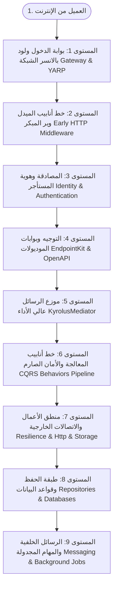

# الدليل الشامل لترتيب مراجعة مكتبات التولكيت من البداية للنهاية (Top-to-Down Request Lifecycle)
# Complete Top-Down HTTP Request Lifecycle & Library Review Blueprint

---

## 🎯 مقدمة وفلسفة الترتيب من الأعلى للأسفل (Top-to-Down)

هذا الدليل يمثل **المسار الواقعي الحقيقي للطلب (The Real Journey of an HTTP Request)** منذ اللحظة الأولى التي يصل فيها نبض الشبكة من متصفح أو موبايل العميل، نزولاً عبر كافة بوابات الحماية والميدل وير، ثم فحص الهوية والـ Auth، ثم التوجيه وتوزيع الـ Mediator، ثم خطوط أنابيب الـ CQRS، ثم المعالجة وقواعد البيانات، وحتى المهام الخلفية والإشعارات.

تم ترقيم كافة مكتبات مشروع `KyrolusSous.AspNetCoreToolkit` بالكامل (جميع الـ 57+ مشروعاً) بترتيب تسلسلي صارم **واحد تلو الآخر** ليسهل عليك مراجعتها خطوة بخطوة وفهم دور كل مكتبة في الرحلة.

---

---

## 🧭 الترتيب التسلسلي الكامل للمكتبات (خطوة بخطوة من 1 إلى 57)

---

### المستوى 1: بوابة الدخول ولود بالانسر الشبكة (Ingress & Gateway Layer)
*أول نقطة اتصال على حافة الإنترنت تستقبل الـ TCP Connection وتقوم بتوزيع الأحمال وتوجيه النطاقات.*

1. **`KyrolusSous.Gateway.Abstractions`**
   - عقود توجيه المسارات (`KyrolusGatewayRoute`) وعناقيد السيرفرات (`KyrolusGatewayCluster`) وخوارزميات توزيع الأحمال (`LoadBalancingPolicy`).
2. **`KyrolusSous.Gateway.Yarp`**
   - محرك الـ Reverse Proxy والـ Load Balancer المبني فوق Microsoft YARP؛ يحقن `X-Correlation-ID`، وهيدرات الأمان، والـ Rate Limiting، والتوجيه حسب الدومين الفرعي (`X-Tenant-ID`).

---

### المستوى 2: خط أنابيب الميدل وير المبكر (Early Inbound HTTP Pipeline)
*أول ما يدخل الريكوست إلى سيرفر الـ ASP.NET Core (Kestrel) قبل لمس أي كود برمجي للمشروع.*

3. **`KyrolusSous.EndpointKit.Core` (طبقة الـ Middleware)**
   - **`KyrolusSecurityHeadersMiddleware`**: حقن هيدرات الحماية من المتصفحات (`X-Frame-Options: DENY` لمنع Clickjacking، و `X-Content-Type-Options: nosniff`، و `X-XSS-Protection`).
   - **`KyrolusCorrelationMiddleware`**: قراءة أو توليد `X-Correlation-ID` وربطه بـ W3C Activity والـ Logging Scope.
4. **`KyrolusSous.Logging.Abstractions`**
   - عقود التسجيل الزمني، وفئات اللوجز، والـ Log Level Switches.
5. **`KyrolusSous.Logging.Core`**
   - محرك اللوجز المتقدم؛ يحتوي على `KyrolusHttpLoggingMiddleware` لتسجيل كل ريكوست، ومحركات حجب البيانات الحساسة (`DataMasker` و `StringRedactor`) لحماية أرقام البطاقات والباسوردات من الظهور في اللوجز.
6. **`KyrolusSous.Logging.Serilog`**
   - تكامل محرك Serilog المتقدم بنسق ECS (Elastic Common Schema) وثيمات الـ ANSI الملونة في الـ Console.
7. **`KyrolusSous.Compression.Abstractions`**
   - عقود ومواصفات خوارزميات الضغط (`IKyrolusCompressor` و `IKyrolusCompressionProvider`).
8. **`KyrolusSous.Compression.Core`**
   - `KyrolusResponseCompressionMiddleware`: فحص هيدر `Accept-Encoding` واختيار الخوارزمية الأنسب لضغط الرد لتقليل استهلاك الباندويث.
9. **حزم خوارزميات الضغط المتخصصة:**
   - **`KyrolusSous.Compression.Brotli`** (أعلى نسبة ضغط للمتصفحات الحديثة).
   - **`KyrolusSous.Compression.Gzip`** (الضغط القياسي المتوافق عالمياً).
   - **`KyrolusSous.Compression.Deflate`** (خوارزمية سريعة وخفيفة).
   - **`KyrolusSous.Compression.Zstd`** (خوارزمية فيسبوك فائقة السرعة والأداء).
   - **`KyrolusSous.Compression.Lz4`** (ضغط فوري للبيانات الكبيرة).
   - **`KyrolusSous.Compression.Snappy`** (خوارزمية جوجل المخصصة لأقل استهلاك CPU).
10. **`KyrolusSous.ExceptionHandling.Abstractions`**
    - تصنيفات الاستثناءات، وعقود الـ Error Registry، ومستخرجات الـ Metadata.
11. **`KyrolusSous.ExceptionHandling.Runtime`**
    - `ExceptionHandlingMiddleware`: صمام الأمان الشامل الذي يحيط بالطلب بالكامل، ليمسك أي عطل مفاجئ (Unhandled Exception) ويحوله لرسالة خطأ مهذبة.
12. **`KyrolusSous.ExceptionHandling.ProblemDetails`**
    - محول الأخطاء المعياري وفق مواصفة RFC 7807 (ProblemDetails) المتوافق مع Native AOT لإخفاء تفاصيل الكود والـ StackTrace في بيئة الـ Production.

---

### المستوى 3: المصادقة وعزل هوية المستأجرين (Identity, Authentication & Multi-Tenancy)
*تحديد من هو المتصل؟ وما هي شركته؟ وهل توكنه سليم ومصرح له؟*

13. **`KyrolusSous.Auth.MultiTenancy`**
    - `KyrolusTenantResolutionMiddleware`: قراءة المستأجر (`TenantId`) من الهيدر أو الدومين أو التوكن وتثبيته في الـ `TenantContext`.
14. **`KyrolusSous.Auth.Abstractions`**
    - عقود المستخدمين (`KyrolusAuthUser`)، وحالات الحظر (`Lockout`)، والمطالبات (`Claims`).
15. **`KyrolusSous.Auth.Runtime`**
    - محرك التشفير وتجزئة كلمات المرور (PBKDF2 Password Hasher)، ومصنع إنشاء الـ `ClaimsPrincipal`.
16. **`KyrolusSous.Auth.Jwt`**
    - فحص توكن الـ JWT الوارد؛ فرض مفاتيح 256-bit على الأقل، حظر خوارزمية `none`، وتوليد الـ `jti` و `iat` تلقائياً.
17. **`KyrolusSous.Auth.TokenRevocation`**
    - `KyrolusTokenRevocationValidator`: فحص التوكن ضد القائمة السوداء اللحظية (In-Memory أو EF Core أو Marten أو Redis) لمنع استخدام التوكنات المسروقة أو بعد الـ Logout.
18. **`KyrolusSous.Auth.ApiKey`**
    - فحص مفاتيح الـ API Keys في حال كان الطلب قادماً من نظام ميكروسيرفيس إلى ميكروسيرفيس أخرى عبر الـ Header.
19. **`KyrolusSous.Auth.Security`**
    - درع حماية الحسابات من التخمين الشرس (`IKyrolusBruteForceGuard`) وفاحص سياسات قوة كلمات المرور (NIST Guidelines).
20. **`KyrolusSous.Auth.Permissions`**
    - فحص الصلاحيات الدقيقة (Fine-Grained Permissions) والـ Wildcard evaluation (`Orders.*`).
21. **`KyrolusSous.Auth.Sessions`**
    - إدارة جلسات الأجهزة النشطة والتحكم في تسجيل الخروج عن بُعد للموبايل أو التابلت.
22. **`KyrolusSous.Auth.OpenIddict`**
    - بروتوكولات تسجيل الدخول الموحد OAuth 2.0 / OIDC، ونقاط نهاية إصدار وتجديد التوكنات.
23. **مكتبات المصادقة والمزودات الملحقة:**
    - **`KyrolusSous.Auth.Mfa`** (التحقق بخطوتين عبر رموز TOTP وتوليد كود الـ QR).
    - **`KyrolusSous.Auth.MagicLink`** (الدخول بدون كلمة مرور عبر روابط البريد الإلكتروني).
    - **`KyrolusSous.Auth.Tokens`** (توكنات تفعيل البريد وإعادة تعيين كلمة المرور الموقعة بـ HMAC).
    - **`KyrolusSous.Auth.Impersonation`** (ميزة تقمص حسابات المستخدمين للدعم الفني بأمان كامل).
    - **`KyrolusSous.Auth.Events`** (سجل أحداث الدخول والفشل الأمني).
    - **مزودات الدخول الاجتماعي (Social OAuth Providers):**
      `Auth.Google`, `Auth.GitHub`, `Auth.Facebook`, `Auth.Apple`, `Auth.Discord`, `Auth.LinkedIn`, `Auth.MicrosoftAccount`, `Auth.X`.
    - **تكاملات تخزين الحسابات:**
      `Auth.EntityFramework` و `Auth.Marten`.

---

### المستوى 4: التوجيه وبوابات الموديولات (EndpointKit & Route Mapping)
*مطابقة رابط الـ URL المطلوب وتجهيز الموديول المناسب لاستقباله.*

24. **`KyrolusSous.EndpointKit.Core` (طبقة الـ Endpoints)**
    - `DefaultRouteMapper` و `BaseKyrolusModule`: توجيه الطلب للـ Handler المخصص، وتطبيق فلاتر الـ Endpoints (`KyrolusValidationEndpointFilter`، `KyrolusTenantEndpointFilter`).
    - تجهيز مغلف الردود القياسي `KyrolusResponseEnvelope` ودعم روابط الـ HATEOAS وحقول الـ Sparse Fieldsets.
25. **`KyrolusSous.OpenApi`**
    - محرك توثيق الـ APIs في .NET 10، ودعم سمات الصلاحيات وحقول المستأجرين في التوثيق.
26. **`KyrolusSous.OpenApi.SwaggerUI`**
    - واجهات تصفح وتجربة الـ Endpoints عبر Swagger UI و Scalar و ReDoc.

---

### المستوى 5: موزع الرسائل والأوامر (KyrolusMediator Dispatcher)
*تسليم الطلب لموزع الأوامر الداخلي لنقله من الـ Controller/Minimal API إلى الـ CQRS Pipeline.*

27. **`KyrolusSous.Mediator.Abstractions`**
    - عقود `IKyrolusMediator` و `IKyrolusRequest` و `IKyrolusCommand` و `IKyrolusQuery`.
28. **`KyrolusSous.Mediator.Runtime`**
    - المحرك الأساسي لتوزيع الأوامر وتمريرها داخل خط أنابيب الـ Behaviors بأقل حجز للذاكرة (Zero-Allocation).
29. **`KyrolusSous.Mediator.Reflection`**
    - محرك التوزيع التلقائي عبر الـ Reflection للبيئات التي لا تدعم الـ Source Generators.
30. **`KyrolusSous.Mediator.Generator`**
    - المولد البرمجي (Roslyn Incremental Source Generator) الذي يولد كود التوزيع مسبقاً أثناء الـ Compile Time ليعمل بـ 100% Native AOT بدون أي Reflection.

---

### المستوى 6: خط أنابيب المعالجة والأمان (CQRS Behaviors Pipeline)
*القلب النابض للنظام؛ حيث يمر كل أمر أو استعلام داخل 12 طبقة حماية متتالية مرتبة بأرقام الأولويات الصارمة:*

31. **`KyrolusSous.CQRS.Abstractions` (البوابة الأولى - الترتيب `[-2100]`):**
    - `KyrolusExceptionMappingBehavior`: اعتراض وترجمة أي استثناء داخلي يقع داخل الـ Handler.
32. **`KyrolusSous.Audit.Abstractions` & `KyrolusSous.Audit.Core` (الترتيب `[-2050]`):**
    - `KyrolusAuditBehavior`: تسجيل وتوثيق كل أمر يدخل النظام في جدول الـ Audit Trail (من قام بالعملية، ومتى، وما هي البيانات القديمة والجديدة).
33. **`KyrolusSous.CQRS.Abstractions` (حارس الصلاحيات - الترتيب `[-1050]`):**
    - `KyrolusAuthorizationBehavior`: التحقق من أن المستخدم يمتلك تصريح تنفيذ هذا الأمر بالتحديد `[KyrolusAuthorize]`.
34. **`KyrolusSous.CQRS.Abstractions` (حارس المستأجر - الترتيب `[-1040]`):**
    - `KyrolusTenantScopingBehavior`: مطابقة الـ `TenantId` الخاص بالأمر مع ما هو مشفر في توكن المستخدم ومنع أي تلاعب Cross-Tenant.
35. **`KyrolusSous.CQRS.Validation` (حارس التحقق - الترتيب `[-950]`):**
    - `KyrolusValidationBehavior`: فحص سلامة الحقول وصحتها عبر مكتبات التحقق:
      - `Validation.Abstractions` & `Validation.Runtime`.
      - `Validation.Fluent` & `Validation.FluentValidation` & `Validation.FluentValidation.Scanning`.
      - `Validation.DataAnnotations` & `Validation.DataAnnotations.Generator`.
      - `Validation.Generator`.
36. **`KyrolusSous.CQRS.Abstractions` (حارس الخصائص - الترتيب `[-940]`):**
    - `KyrolusPropertyAllowListBehavior`: حظر هجمات الـ Mass Assignment والتأكد من أن كل الحقول المطلوبة مصرح بها صراحة في الـ Allow-List.
37. **`KyrolusSous.CQRS.Abstractions` (منع الإغراق - الترتيب `[-750]`):**
    - `KyrolusThrottlingBehavior`: تطبيق سيمفورات التحكم في التزامن (Concurrency Semaphores) لكل مفتاح أو مستخدم أو مستأجر.
38. **`KyrolusSous.CQRS.Caching` (حارس التكرار والكاش - الترتيب `[-500]` إلى `[-200]`):**
    - `KyrolusIdempotencyBehavior` (ترتيب `[-500]`): فحص مفتاح الـ Idempotency لمنع تكرار المعاملات المالية المزدوجة وسد ثغرات TOCTOU.
    - `KyrolusQueryCachingBehavior` (ترتيب `[-300]`): فحص الكاش، فإذا كان الاستعلام مخزناً سابقاً يُعاد فوراً دون لمس قاعدة البيانات.
    - `KyrolusCommandCacheInvalidationBehavior` (ترتيب `[-200]`): إبطال كاش السجلات ذات الصلة عند تنفيذ أمر تعديل أو إضافة.
    - **تعتمد هذه السلوكيات على:**
      - `Caching.Abstractions` & `Caching.Redis` (الكاش الموزع و L1/L2 NearCache).
      - `Caching.MessagePack` (ضغط محتوى الكاش الثنائي فائق السرعة).
39. **`KyrolusSous.CQRS.Mapping` (محول الكائنات - الترتيب `[-100]`):**
    - `KyrolusMappingPipelineBehavior`: تحويل الـ Command/Query DTOs إلى كائنات الدومين، مدعوماً بـ:
      - `Mapping.Abstractions` & `Mapping.Runtime` & `Mapping.Generator`.
40. **`KyrolusSous.CQRS.Saga` (منسق المعاملات الموزعة):**
    - `KyrolusSagaCoordinator`: قيادة خطوات الـ Saga متعددة الخدمات وتنفيذ خطوات التعويض (Compensating Transactions) في حال فشل أي خطوة.

---

### المستوى 7: منطق الأعمال والخدمات الخارجية (Domain Handlers & Integrations)
*تنفيذ منطق العمل الفعلي، واستدعاء البنوك والمخازن الخارجية.*

41. **`KyrolusSous.FeatureManagement.Core`**
    - فحص تفعيل الميزات (Feature Flags) لتشغيل أو تعطيل أجزاء برمجية ديناميكياً بدون إعادة نشر الكود.
42. **`KyrolusSous.Localization.Abstractions` & `KyrolusSous.Localization.Json`**
    - ترجمة مخرجات الـ API ورسائل الخطأ بلغة العميل تلقائياً من ملفات JSON مدعومة بـ Native AOT.
43. **`KyrolusSous.DataProtection.Abstractions` & `KyrolusSous.DataProtection.Runtime`**
    - تشفير وفك تشفير البيانات الحساسة المحفوظة في قاعدة البيانات (مثل أرقام الحسابات والبطاقات).
    - **مزودات التخزين والمفاتيح:**
      `DataProtection.Ephemeral`, `DataProtection.FileSystem`, `DataProtection.CustomXml`, `DataProtection.EntityFramework`, `DataProtection.Redis`, `DataProtection.Marten`, `DataProtection.AzureStorage`, `DataProtection.AzureKeyVault`, `DataProtection.AwsKms`, `DataProtection.GoogleKms`, `DataProtection.Vault`, `DataProtection.Cli`.
44. **`KyrolusSous.Http.Abstractions` & `KyrolusSous.Http.Core`**
    - تنفيذ مكالمات الـ HTTP الصادرة نحو السيرفرات الخارجية، مع استخدام `KyrolusHmacSigner` لتوقيع الطلبات رقمياً ومنع التلاعب والـ Replay Attacks.
45. **`KyrolusSous.Resilience`**
    - درع المرونة الذكي المبني بـ Polly v8؛ يحيط بكل مكالمة خارجية بقاطع الدائرة (Circuit Breaker)، وإعادة المحاولة مع تشتيت الـ Jitter لمنع الـ Thundering Herd، وضبط الـ Timeout.
46. **`KyrolusSous.Storage.Abstractions` & مخازن الملفات:**
    - حفظ الملفات والوسائط والصور المرفوعة عبر:
      `Storage.Local`, `Storage.S3`, `Storage.Azure`.
47. **`KyrolusSous.Payments.Core` & بوابات الدفع:**
    - معالجة المدفوعات والعمليات المالية عبر:
      `Payments.Stripe`, `Payments.PayPal`, `Payments.Mollie`, `Payments.Adyen`, `Payments.Checkout`.

---

### المستوى 8: طبقة الحفظ وقواعد البيانات (Persistence & Data Repositories)
*كتابة أو قراءة السجلات من قواعد البيانات بأعلى كفاءة وأمان.*

48. **`KyrolusSous.EndpointKit.EF` & `KyrolusSous.CQRS.EF`**
    - معالجات الأوامر والاستعلامات الخاصة بـ Entity Framework Core (مثل `GetPagedQueryHandler`، وتصفح `GetSeekQueryHandler` بالمؤشر Keyset لمنع DoS).
    - حماية الأعمدة عبر `EfProtectedPropertyGuard` لمنع التلاعب بالمفاتيح ورموز التزامن.
    - فلاتر عزل المستأجرين التلقائية عبر `KyrolusTenantQueryFilterExtensions`.
49. **`KyrolusSous.Repositories.EF.Abstractions` & `KyrolusSous.Repositories.EF.Runtime`**
    - مستودعات EF Core وقواعد البيانات العلائقية (SQL Server / PostgreSQL / MySQL / SQLite) مدعومة بـ Temporal Tables، وتتبع الاستعلامات، والـ Interceptors.
50. **`KyrolusSous.Repositories.EF.Generator`**
    - مولد كود الـ Repositories مسبقاً بدون تكلفة استهلاك ذاكرة.
51. **`KyrolusSous.Repositories.EF.Cache.Distributed`**
    - مزود كاش المستوى الثاني لقواعد بيانات EF Core لتقليل الضغط على السيرفر.
52. **`KyrolusSous.EndpointKit.Marten` & `KyrolusSous.CQRS.Marten`**
    - معالجات أوامر واستعلامات وثائق PostgreSQL بنمط الـ Document DB و Event Sourcing.
    - حماية الخصائص عبر `MartenProtectedPropertyGuard` وعزل الجلسات عبر `KyrolusMartenTenantSessionFactory`.
53. **`KyrolusSous.Repositories.Marten.Abstractions` & `KyrolusSous.Repositories.Marten.Runtime` & `KyrolusSous.Repositories.Marten.Generator`**
    - مستودعات Marten المتقدمة؛ دعم التعديل الجزئي بالـ JSON Patch، وعمليات الـ Bulk COPY عالية السرعة.
54. **`KyrolusSous.Elasticsearch.Abstractions` & `KyrolusSous.Elasticsearch` & `KyrolusSous.CQRS.Elasticsearch`**
    - محركات البحث الفوري والمطابقة الذكية وإكمال الكلمات التلقائي (Autocomplete) المربوطة بـ Elasticsearch v8.

---

### المستوى 9: الرسائل غير المتزامنة والمهام المجدولة (Async Messaging & Background Jobs)
*ما بعد اكتمال المعاملة وحفظها: إطلاق الأحداث، إشعار المستخدمين، والمهام المجدولة.*

55. **`KyrolusSous.RabbitMQ.Abstractions` & `KyrolusSous.RabbitMQ.Runtime`**
    - نشر أحداث الدومين والتكامل (Integration Events) في طوابير RabbitMQ الموزعة، مع ضمانات التسليم (Publisher Confirms) وطوابير الرسائل الميتة (DLX).
56. **`KyrolusSous.Notifications.Abstractions` & `KyrolusSous.Notifications.Core`**
    - إرسال الإشعارات للمستخدمين في الخلفية عبر مزودات:
      `Notifications.Email.Smtp`, `Notifications.Email.SendGrid`, `Notifications.Sms.Twilio`.
57. **`KyrolusSous.Scheduling.Abstractions` & `KyrolusSous.Scheduling.Quartz` & `KyrolusSous.Scheduling.Redis`**
    - جدولة المهام الدورية (Cron Jobs) في الخلفية؛ مثل تنظيف التوكنات المنتهية، وتفريغ طوابير الـ Outbox، ومراجعة الفواتير المعلقة.

---

## 📊 جدول التلخيص السريع لكل مرحلة:

| المستوى | اسم المرحلة في رحلة الريكوست | ما الذي تفعله تحديداً؟ | أهم المكتبات |
| :--- | :--- | :--- | :--- |
| **1** | **Ingress & Gateway** | استقبال الريكوست على الإنترنت وتوزيع الأحمال | `Gateway.Abstractions`, `Gateway.Yarp` |
| **2** | **Early Inbound Middleware** | حقن هيدرات الأمان، التتبع، وفك الضغط، ومسك الأخطاء | `EndpointKit.Core`, `Logging`, `Compression`, `ExceptionHandling` |
| **3** | **Identity & Multi-Tenancy** | التحقق من المستخدم، المستأجر، وصلاحية التوكن | `Auth.MultiTenancy`, `Auth.Jwt`, `Auth.TokenRevocation`, `Auth.Security` |
| **4** | **Routing & EndpointKit** | مطابقة مسار الـ URL وتغليف الرد وتوثيق OpenAPI | `EndpointKit.Core`, `OpenApi` |
| **5** | **Mediator Dispatcher** | تسليم الطلب الداخلي إلى الـ CQRS Pipeline بسرعة | `Mediator.Abstractions`, `Mediator.Runtime`, `Mediator.Generator` |
| **6** | **CQRS 12-Layer Behaviors** | دروع الحماية الصارمة (تدقيق، صلاحيات، تحقق، كاش، إيدمبوتنسي) | `CQRS.Abstractions`, `CQRS.Validation`, `CQRS.Caching`, `CQRS.Mapping` |
| **7** | **Domain & Resilience** | استدعاء الخدمات الخارجية المحمية بقواطع Polly و HMAC | `Resilience`, `Http.Core`, `Storage`, `Payments` |
| **8** | **Data Persistence** | قراءة وكتابة السجلات بقواعد البيانات وتصفح Keyset | `Repositories.EF`, `Repositories.Marten`, `Elasticsearch` |
| **9** | **Async Messaging & Jobs** | نشر الأحداث في RabbitMQ وإرسال الإشعارات والجدولة | `RabbitMQ.Runtime`, `Notifications`, `Scheduling` |

---
**تم إنشاء هذا المرجع الشامل ليكون دليلك الدائم والثابت لمراجعة كافة مكتبات التولكيت بترتيبها الطبيعي المترابط.**
